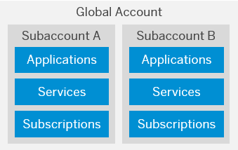
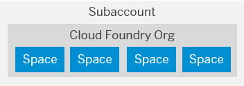

<!-- loio8ed4a705efa0431b910056c0acdbf377 -->

# Account Model

Learn more about the different types of accounts on SAP BTP and how they relate to each other.

Accounts are structured according to global accounts, subaccounts, and directories \[Feature Set B\].

To learn more about managing your account model, see [Account Administration](../50-administration-and-ops/Account_Administration_5d62ec8.md).

 <a name="loioc165d95ee700407eb181770901caec94"/>

<!-- loioc165d95ee700407eb181770901caec94 -->

## Global Accounts

A **global account** is the realization of a contract you made with SAP.

A global account is used to manage subaccounts, members, entitlements and quotas. You receive entitlements and quotas to use platform resources per global account and then distribute the entitlements and quotas to the subaccount for actual consumption. There are two types of global accounts: enterprise accounts \(paid\) and trial accounts \(free\). The type determines pricing, conditions of use, resources, available services, scope of the functionality that you can use, and the level of support you can receive.

Global accounts are region- and environment-independent. Within a global account, you manage all of your subaccounts, which in turn are specific to one region.

SaaS applications are usually displayed in a separate global account.

 <a name="loio8d6e3a0fa4ab43e4a421d3ed08128afa"/>

<!-- loio8d6e3a0fa4ab43e4a421d3ed08128afa -->

## Subaccounts

**Subaccounts** let you structure a global account according to your organization’s and project’s requirements with regard to members, authorizations, and entitlements.

A global account can contain one or more subaccounts in which you deploy applications, use services, and manage your subscriptions. Subaccounts in a global account are independent from each other. This is important to consider with respect to security, member management, data management, data migration, integration, and so on, when you plan your landscape and overall architecture.

Each subaccount is associated with a region, which is the physical location where applications, data, or services are hosted. The specific region is relevant when you deploy applications and access the SAP BTP cockpit using the corresponding cockpit URL. The region assigned to your subaccount doesn't have to be directly related to your location. You could be located in the United States, for example, but operate your subaccount in Europe.

The entitlements and quotas that have been purchased for a global account have to be assigned to the individual subaccounts.

Global accounts and subaccounts are completely independent of user accounts. For more information, see [User and Member Management](User_and_Member_Management_cc1c676.md).

**Relationship between Subaccounts, Orgs, and Spaces**

When you enable the Cloud Foundry environment in one of your subaccounts, the system automatically creates a Cloud Foundry org for you. The subaccount and the org have a 1:1 relationship and the same navigation level in the cockpit \(even though they may have different names\). You can create spaces within that Cloud Foundry org. Spaces let you further break down your account model and use services and functions in the Cloud Foundry environment.

For more information about Cloud Foundry orgs and spaces, see the Cloud Foundry documentation at [https://docs.cloudfoundry.org/concepts/roles.html](https://docs.cloudfoundry.org/concepts/roles.html).

 <a name="loioa92721fc75524ec09a7a7255997dbd94"/>

<!-- loioa92721fc75524ec09a7a7255997dbd94 -->

## Directories \[Feature Set B\]

**Directories** allow you to organize and manage your subaccounts according to your technical and business needs.

A directory can contain directories and subaccounts to create a hierarchy. Using directories to group other directories and subaccounts is optional - you can still create subaccounts directly under your global account.

You can create a hierarchical structure that is 7 levels deep. The highest level of a given path is always the global account and the lowest is a subaccount, which means that you can have up to 5 levels of directories.

Directories allow you to:

-   Group and filter directories and subaccounts

-   Monitor usage and, for contracts that use the consumption-based model, cost

-   Set custom properties and tags for identification and reporting purposes

In addition, you can also add the following features to your directories \(optional\):

-   Manage Entitlements: Enables the assignment of a quota for services and applications to the directory from the global account quota for distribution to the directory's subaccounts.

    When you assign entitlements to a directory, you express the entitlements and maximum quota that can be distributed across its children subaccounts. You also have the option to choose the auto-assignment of a set amount of quota to all subaccounts created or moved to that directory. Subaccounts that are already in the directory when you select that option will not be auto-assigned quota.

-   Manage Authorizations: Enables a custom identity provider and/or authorization management for the directory. For example, it allows certain users to manage directory entitlements. You can only use this feature in combination with the *Manage Entitlements* feature.

**Related Information**  

[Manage the Account Explorer Hierarchy \[Feature Set B\]](../50-administration-and-ops/Manage_the_Account_Explorer_Hierarchy_Feature_Set_B_2e2a5b6.md "Create an account structure by creating a hierarchy of directories and subaccounts using the SAP BTP cockpit. Add, move, and delete subaccounts and directories in your structure.")

[Getting a Global Account](../20-getting-started/Getting_a_Global_Account_d61c281.md#loiod61c2819034b48e68145c45c36acba6e "SAP BTP offers two types of global accounts: Trial accounts and enterprise accounts.")

[Setting Up Your Account Model](https://help.sap.com/viewer/df50977d8bfa4c9a8a063ddb37113c43/Cloud/en-US/2db81f42f5194454beecde6cd4994dda.html "The hierarchical structure between global accounts, directories, and subaccounts lets you define an account model that accurately fits your business and development needs.") :arrow_upper_right:

[Managing Global Accounts Using the Cockpit](../50-administration-and-ops/Managing_Global_Accounts_Using_the_Cockpit_667f34b.md "Your SAP BTP global account is the entry point for managing the resources, landscape, and entitlements for your departments and projects in a self-service manner.")

[Managing Directories Using the Cockpit \[Feature Set B\]](../50-administration-and-ops/Managing_Directories_Using_the_Cockpit_Feature_Set_B_f495ac1.md "Learn how to organize and manage your subaccounts according to your technical and business needs by using directories in the SAP BTP cockpit.")

[Managing Subaccounts Using the Cockpit](../50-administration-and-ops/Managing_Subaccounts_Using_the_Cockpit_55d0b6d.md "Learn how to structure a global account according to your organization’s and project’s requirements with regard to members, authorizations, and entitlements by managing subaccounts.")

[Working with Global Accounts, Directories, and Subaccounts Using the btp CLI](../50-administration-and-ops/Working_with_Global_Accounts,_Directories,_and_Subaccounts_Using_the_btp_CLI_85a683e.md "Use the SAP BTP command line interface (btp CLI) to manage operations with global accounts, directories, and subaccounts.")

 <a name="loioeeda449cf252418a97e0f7c9abd30b9a"/>

<!-- loioeeda449cf252418a97e0f7c9abd30b9a -->

## Relationship Between Global Accounts and Subaccounts \[Feature Set A\]

A global account can group together different subaccounts that an administrator makes available to users. Administrators can assign the available quotas of a global account to its different subaccounts and move it between subaccounts that belong to the same global account.

The hierarchical structure of global accounts and subaccounts lets you define an account model that accurately fits your business and development needs. For example, if you want to separate development, testing, and productive usage, you can create a subaccount for each of these scenarios in your global account. You can also create subaccounts for different development teams or departments in your organizations.

For more information about the relationship between a global account and its subaccounts, see the graphic in [Basic Platform Concepts](https://help.sap.com/viewer/df50977d8bfa4c9a8a063ddb37113c43/Cloud/en-US/38ecf59cdda64150a102cfaa62d5faab.html#loio38ecf59cdda64150a102cfaa62d5faab "SAP BTP offers users the ability to turn data into business value, compose end-to-end business processes, and build and extend SAP applications quickly.") :arrow_upper_right:. For best practices, see [Setting Up Your Account Model](https://help.sap.com/viewer/df50977d8bfa4c9a8a063ddb37113c43/Cloud/en-US/2db81f42f5194454beecde6cd4994dda.html "The hierarchical structure between global accounts, directories, and subaccounts lets you define an account model that accurately fits your business and development needs.") :arrow_upper_right:.

 <a name="loio20828fc639954939890d3d74a22c5f66"/>

<!-- loio20828fc639954939890d3d74a22c5f66 -->

## Relationship Between Global Accounts, Subaccounts, and Directories \[Feature Set B\]

A global account can group together different directories and subaccounts that an administrator makes available to users. Administrators can assign the available entitlements and quotas of a global account to its different subaccounts and move it between subaccounts that belong to the same global account.

> ### Note:  
> The content in this section is only relevant for cloud management tools feature set B. For more information, see [Cloud Management Tools - Feature Set Overview](https://help.sap.com/viewer/65de2977205c403bbc107264b8eccf4b/Cloud/en-US/caf4e4e23aef4666ad8f125af393dfb2.html).

The hierarchical structure of global accounts, directories, and subaccounts lets you define an account model that accurately fits your business and development needs. For example, if you want to separate development, testing, and productive usage for different departments in your organization, you can create a directory for each department, and within each directory, you group subaccounts for development, testing, and production.

 <a name="loioe8663c08ead648faa673b0d63c5b478e"/>

<!-- loioe8663c08ead648faa673b0d63c5b478e -->

## Custom Properties \[Feature Set B\]

Custom properties allow you to label or tag your directories and subaccounts according to your own business and technical needs. This makes organizing and filtering your directories and subaccounts easier within your global account.

You create and assign custom properties when you create or edit a directory or subaccount. Using custom properties is optional.

Each custom property has a name \(also referred to as a key\) and typically one or more values that are associated with the property. You can also assign a custom property to a directory or subaccount without giving a specific value. When no value is given, the custom property behaves like a tag. Here are some examples of custom properties:

<table>
<tr>
<th valign="top">

Custom Property \(Name\)

</th>
<th valign="top">

Property Values

</th>
</tr>
<tr>
<td valign="top">

Landscape

</td>
<td valign="top">

Dev  
 Test  
 Production

</td>
</tr>
<tr>
<td valign="top">

Department

</td>
<td valign="top">

HR  
 IT  
 Finance  
 Sales

</td>
</tr>
<tr>
<td valign="top">

Cost Center

</td>
<td valign="top">

000001134789  
 000002155534  
 To be defined

</td>
</tr>
<tr>
<td valign="top">

Flagged for Deletion

</td>
<td valign="top">

*\(no values\)*

</td>
</tr>
<tr>
<td valign="top">

Important

</td>
<td valign="top">

*\(no values\)*

</td>
</tr>
</table>

Consider the following when working with custom properties:

-   Each directory or subaccount can have up to 10 custom properties assigned to it.

-   You cannot add the same custom property with a different value to the same directory or subaccount.

-   Directories do not share their custom properties with subaccounts, and vice versa. However, when you view the custom properties of a subaccount, it also shows the custom properties assigned to its parent directory, if one exists.

-   When you create a custom property or assign a new value to a property in a directory, they become available for use across all the directories in your global account. The also applies to subaccounts.

-   Property names \(keys\) are case-insensitive, which means you cannot create variants of the same property name with different casing \(for example, "MyKey" and "myKey" cannot coexist\). Property values on the other hand are case-sensitive; be careful not to create unwanted variants of the same names or values with a different casing or styling.

-   To remove a custom property that is assigned to a directory or subaccount, or to change the assigned value of a property, or to add a property, you must edit the directory or subaccount.

-   Currently, you cannot manage all custom properties for all directories and subaccounts from a central page. Custom properties can only be managed on the level of individual directories and subaccounts.

> ### Tip:  
> -   You can view the custom properties that are assigned to a directory or subaccount by choosing the *More Info* option of each directory and subaccount in the *Account Explorer* page in the SAP BTP cockpit. Assigned custom properties are also listed when in the *Overview* page of every directory and subaccount.
> 
> -   In the *Account Explorer* page in the cockpit, you can filter the displayed directories and subaccounts by their assigned custom properties.

**Related Information**  

[Create a Subaccount](../50-administration-and-ops/Create_a_Subaccount_05280a1.md "Create subaccounts in your global account using the SAP BTP cockpit.")

[Change Subaccount Details](../50-administration-and-ops/Change_Subaccount_Details_567d4a8.md "Edit subaccounts using the SAP BTP cockpit.")

[Create a Directory \[Feature Set B\]](../50-administration-and-ops/Create_a_Directory_Feature_Set_B_b8ef1c4.md "Create a directory using the SAP BTP cockpit to organize and manage your subaccounts. For example, you can group subaccounts by project, team, or department.")

[Cloud Management Tools — Feature Set Overview](Cloud_Management_Tools_—_Feature_Set_Overview_caf4e4e.md "Cloud management tools represent the group of technologies designed for managing SAP BTP.")

