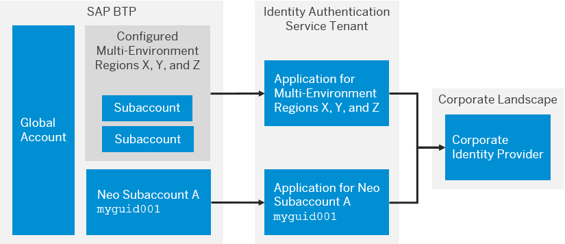

<!-- loio783ff50aa60a4c488f4a1e4dceee7ab9 -->

# Bringing Your Corporate Identity Provider for Platform Users \[Feature Set A\]

SAP BTP supports the use of your own identity provider for platform users. The use of your own identity provider requires integration between the user bases of Cloud Foundry and Neo environments.

> ### Note:  
> The content in this section is only relevant for cloud management tools feature set A. For more information, see [Cloud Management Tools - Feature Set Overview](https://help.sap.com/viewer/65de2977205c403bbc107264b8eccf4b/Cloud/en-US/caf4e4e23aef4666ad8f125af393dfb2.html).

Platform users perform technical development, deployment, and administration tasks. They perform subaccount administration in the SAP BTP cockpit or access the Cloud Foundry command-line interface \(CF CLI\). By hosting these users in your own identity provider, you gain a number of advantages over hosting them in SAP ID service.

-   Integrate the management of these users with your broader identity management strategy, hosted on your own identity providers. You control your own user lifecycle and single sign-on strategies throughout the entire landscape.

-   Enforce your own password and authentication policies, such as stronger passwords or multifactor authentication.

The following figure illustrates the architecture required for platform users. This configuration is independent of the default configuration with SAP ID service. You can continue to use SAP ID service in parallel for platform users.

   
  
<a name="loio783ff50aa60a4c488f4a1e4dceee7ab9__fig_ycv_3jz_4mb"/>Architecture Required for Custom User Base of Platform Users

  

In the preceding figure, you enable trust between SAP BTP and your corporate identity provider over your tenant of SAP Cloud Identity Services - Identity Authentication. For each Neo subaccount, you choose the Identity Authentication tenant to use as the platform identity provider. The Identity Authentication tenant automatically configures an application within the tenant and generates an identifier to establish the connection between the two entities. When you log on to a platform resource, such as the cockpit, you indicate the Neo subaccount you want to log on with using this identifier in the subdomain, for example, `https://account-abcd123456.hana.ondemand.com/cockpit`. SAP BTP uses the connection between subaccount and Identity Authentication application to identify your corporate identity provider to perform the authentication. Once you’ve logged on with your platform user, the cockpit displays any global accounts and subaccounts your platform user is a member of.

> ### Note:  
> An e-mail address alone isn’t enough to determine membership in an account. For Neo subaccounts the identifier is the user base \(identity provider\) and a configurable identifier with the user base; usually the user ID. For multi-environment subaccounts, the identifier is the origin \(your Cloud Foundry-specific alias for the identity provider\) and e-mail address. For example, you can have a platform user in the default identity provider, SAP ID service, and another user in your corporate identity provider with the same e-mail address. You can log on to the cockpit with both, but the cockpit displays different user information. This difference is because you’ve logged on with different identity providers.
> 
> You also see this difference when assigning roles or membership in subaccount. You must provide the user base or origin in addition to the e-mail address of the user. You can choose your own origin for multi-environment accounts, but the origin must be unique across all SAP customers. We recommend using the subdomain of your Identity Authentication tenant or your organization's name. All your users must be able to remember or type the origin when they use the Cloud Foundry command-line interface or service dashboards. A string of random characters isn't useful.

To use a corporate identity provider for platform users of a multi-environment subaccount, you need a Neo subaccount set up for the same corporate identity provider. This requirement exists, because logon to the cockpit is dependent on a Neo subaccount. You’re extending the existing configuration of your Neo subaccount to add the trust of your corporate identity provider to your multi-environment subaccounts.

For Neo subaccounts, there’s a 1:1 relationship between its applications in your Identity Authentication tenant. Multi-environment subaccounts are handled differently. During configuration, you submit a support ticket in which you state all the regions you want to apply this corporate identity provider configuration. This trust then applies to **all** your multi-environment subaccounts in those regions. So, all your multi-environment subaccounts share the same application in your Identity Authentication tenant.

Configuring platform users for multi-environment subaccounts has no impact on your existing Neo configuration. You need the Neo configuration to log on to resources like the cockpit.

> ### Recommendation:  
> While support of multiple corporate identity providers is possible, we recommend using your Identity Authentication tenant as a hub and use conditional authentication to separate them.

**Related Information**  

[Establish Trust and Federation of Custom Identity Providers for Platform Users in Multi-Environment Subaccounts \[Feature Set A\]](../50-administration-and-ops/Establish_Trust_and_Federation_of_Custom_Identity_Providers_8600afb.md "By default, platform users in multi-environment subaccounts are users in SAP ID service. The use of your own identity provider requires integration between the user bases of multi-environment and Neo subaccounts.")

[Log On with a Custom Identity Provider to the Cloud Foundry Environment Using the Cloud Foundry Command-Line Interface](../50-administration-and-ops/Log_On_with_a_Custom_Identity_Provider_d477618.md "Learn how to use different methods to log on to Cloud Foundry using a custom identity provider (IdP).")

