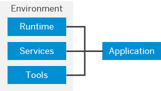

<!-- loio15547f7e7ecd47ee9fa052b0e18c7b0a -->

# Environments

Environments constitute the actual platform-as-a-service offering of SAP BTP that allows for the development and administration of business applications. Environments are anchored in SAP BTP on subaccount level. 

 Each environment comes equipped with specific tools, technologies, and runtimes that you need to build applications. So a multi-environment subaccount is your single address to host a variety of applications and offer diverse development options. One advantage of using different environments in one subaccount is that you only need to manage users, authorizations, and entitlements once per subaccount, and thus grant more flexibility to your developers.

<a name="loio15547f7e7ecd47ee9fa052b0e18c7b0a__section_brc_k2l_kpb"/>

## Environment Instances

To actually use an environment in a subaccount, you need to**enable** it by creating an instance of that environment. There are several ways to create **environment instances**:

-   Using the subaccount overview page in the cockpit: choose Enable.

-   Using the Service Marketplace tab in the cockpit: here you get more information, such as the available plans and links to further information.

-   Using the btp CLI command `btp create accounts/environment-instance`

-   **[Cloud Foundry Environment](Cloud_Foundry_Environment_9c7092c.md#loio9c7092c7b7ae4d49bc8ae35fdd0e0b18 " The Cloud
                                Foundry environment allows you to create polyglot
		cloud applications in Cloud
                                Foundry. It contains the SAP BTP, Cloud Foundry
                                    runtime service, which is based on the open-source application platform managed by the Cloud
                                Foundry Foundation.")**  
 The Cloud Foundry environment allows you to create polyglot cloud applications in Cloud Foundry. It contains the SAP BTP, Cloud Foundry runtime service, which is based on the open-source application platform managed by the Cloud Foundry Foundation.
-   **[ABAP Environment](ABAP_Environment_11d6265.md "Within the Cloud
                                Foundry environment, you can create a new space for ABAP development. This is
                                                                           what we refer to as the ABAP environment. It allows you to create
                                                                           extensions for ABAP-based products, such as SAP S/4HANA Cloud, and develop
                                                                           new cloud applications. You can transform existing ABAP-based custom code
                                                                           or extensions to the cloud.")**  
Within the Cloud Foundry environment, you can create a new space for ABAP development. This is what we refer to as the ABAP environment. It allows you to create extensions for ABAP-based products, such as SAP S/4HANA Cloud, and develop new cloud applications. You can transform existing ABAP-based custom code or extensions to the cloud.
-   **[Kyma Environment](Kyma_Environment_468c2f3.md#loio468c2f3c3ca24c2c8497ef9f83154c44 "Kyma environment provides a fully managed
		Kubernetes runtime based on the open-source project &quot;Kyma&quot;. This cloud-native solution
		allows developers to extend SAP solutions with serverless Functions and combine them with
		containerized microservices.")**  
Kyma environment provides a fully managed Kubernetes runtime based on the open-source project "Kyma". This cloud-native solution allows developers to extend SAP solutions with serverless Functions and combine them with containerized microservices.
-   **[Neo Environment](Neo_Environment_0f79436.md "The Neo
                                                                           environment lets you develop HTML5, Java, and SAP HANA extended application
                                                                           services (SAP HANA XS) applications. You can also use the UI Development
                                                                           Toolkit for HTML5 (SAPUI5) to develop rich user interfaces for modern
                                                                           web-based business applications.")**  
The Neo environment lets you develop HTML5, Java, and SAP HANA extended application services \(SAP HANA XS\) applications. You can also use the UI Development Toolkit for HTML5 \(SAPUI5\) to develop rich user interfaces for modern web-based business applications.

**Related Information**  

[Account Administration](../50-administration-and-ops/Account_Administration_5d62ec8.md "Learn how to manage global accounts, directories, and subaccounts on SAP BTP using different tools.")

