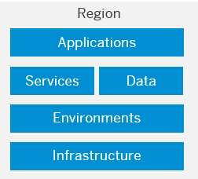

<!-- loio350356d1dc314d3199dca15bd2ab9b0e -->

# Regions

You can deploy applications in different **regions**. Each region represents a geographical location \(for example, Europe, US East\) where applications, data, or services are hosted. 

<a name="loio350356d1dc314d3199dca15bd2ab9b0e__section_e22_fsf_wrb"/>

## About SAP BTP Regions

Regions are provided either by SAP or by our Infrastructure-as-a-Service \(IaaS\) partners Amazon Web Services \(AWS\), Microsoft Azure, Google Cloud, and Alibaba Cloud. The third-party region providers operate the infrastructure layer of the regions, whereas SAP operates the platform layer and Cloud Foundry.

For an overview of all available regions, see [SAP Discovery Center](https://discovery-center.cloud.sap/#/viewServices): 

<a name="loio350356d1dc314d3199dca15bd2ab9b0e__select-region"/>

## Selecting a Region

A region is chosen at the subaccount level. For each subaccount, you select exactly one region. The selection of a region is dependent on many factors: For example, application performance \(response time, latency\) can be optimized by selecting a region close to the user. For more information, see [Selecting a Region](https://help.sap.com/viewer/df50977d8bfa4c9a8a063ddb37113c43/Cloud/en-US/38ecf59cdda64150a102cfaa62d5faab.html#loioabaaf083a6574edc8ad30d9cd9a062f3 "You can deploy applications in different regions. Each region represents a geographical location (for example, Europe, US East) where applications, data, or services are hosted.") :arrow_upper_right:.

<a name="loio350356d1dc314d3199dca15bd2ab9b0e__deploy-applications"/>

## Deploying Applications in Regions

When deploying applications, consider that a subaccount is associated with a particular region and that this is independent of your own location. You may be located in the United States, for example, but operate your subaccount in a region in Europe. For more information on subaccounts, see [Subaccounts](account-model-8ed4a70.md#loio8d6e3a0fa4ab43e4a421d3ed08128afa).

To deploy an application in more than one region, execute the deployment separately for each host. For more information, see [Deploy an Application](../50-administration-and-ops/deploy-an-application-09fdb9b.md).

Within a region, there can be multiple instances of the SAP BTP, Cloud Foundry environment. When creating a subaccount, SAP BTP automatically assigns the account to a specific instance of the environment. Several subaccounts of the same global account can be located in different datacenters in one region. This also affects the format of the API endpoint URL that is displayed in the cockpit after enabling Cloud Foundry in your subaccount. There are two possible formats for the API endpoint URL, either displayed with or without an index. Here's an example for **eu10**:

> ### Example:  
> -   https://api.cf.eu10.hana.ondemand.com
> -   https://api.cf.eu10-<XXX\>.hana.ondemand.com

In both cases, the subaccount is located in the region eu10. The differences in the URLs are only an indicator of technical details on the side of SAP BTP and do not affect the functionality of your applications. For information on enabling Cloud Foundry, see [Create Orgs](../50-administration-and-ops/create-orgs-a9b1f54.md).

<a name="loio350356d1dc314d3199dca15bd2ab9b0e__section_thb_cvf_wrb"/>

## High Availability

SAP has a number of processes in place to support resilience in SAP BTP, and provides different offerings so that you can support the high availability of your applications. For more information, see [Resilience, High Availability, and Disaster Recovery](resilience-high-availability-and-disaster-recovery-e3ac4f7.md#loioe3ac4f7c25a3442ca585950095eec599).

<a name="loio350356d1dc314d3199dca15bd2ab9b0e__section_hbn_sbl_v4b"/>

## EU Access

Some customer contracts include EU Access, which restricts processing of personal data to EEA/Switzerland. If the global account is marked with EU Access, the actual EU Access compliance status of subaccounts will be displayed during creation of subaccounts.

> ### Note:  
> If you need a subaccount with EU Access, make sure to select a provider and region, where EU Access is available. For more information, see [Regions](regions-350356d.md)
> 
> For some services, EU Access is generally not available, not even if the provider and region support EU Access.

**Related Information**  

[Regions and API Endpoints Available for the Cloud Foundry Environment](regions-and-api-endpoints-available-for-the-cloud-foundry-environment-f344a57.md "")

[Regions and API Endpoints for the ABAP Environment](regions-and-api-endpoints-for-the-abap-environment-879f373.md "")

[Regions for the Kyma Environment](regions-for-the-kyma-environment-557ec3a.md "To work with the Kyma environment, you need to specify the region for both your subaccount and the cluster.")

