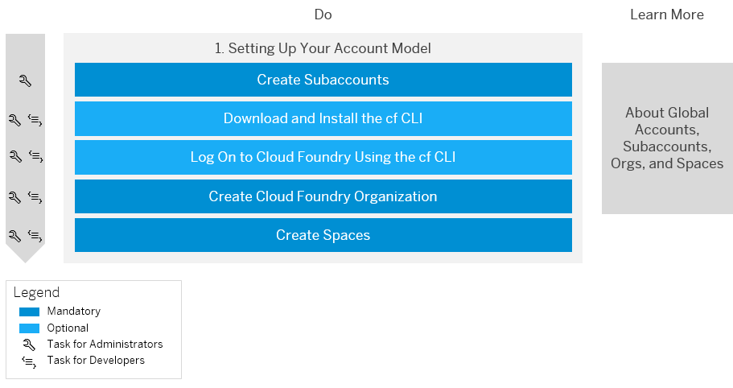
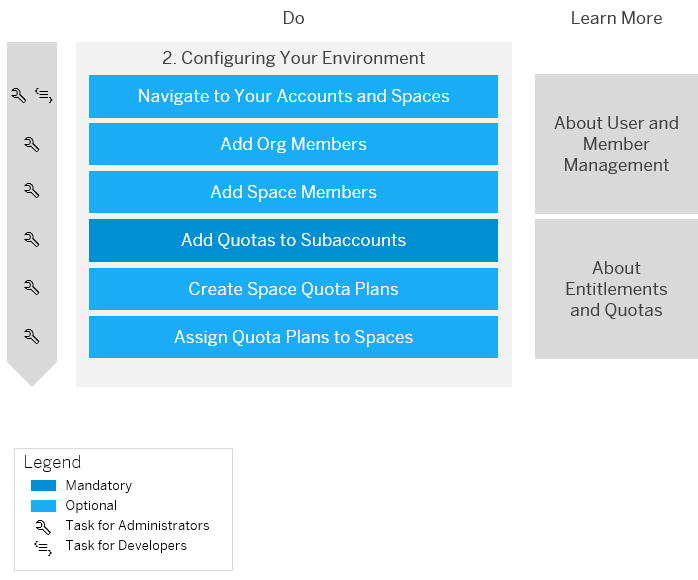
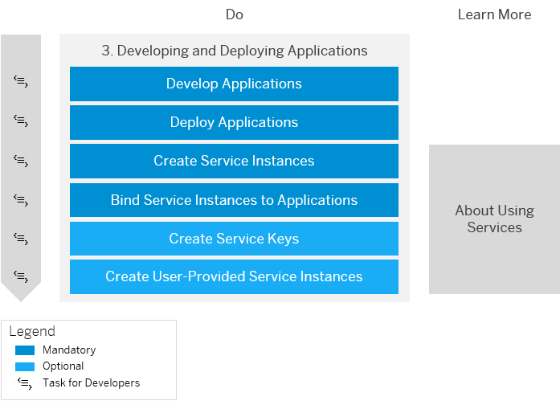

<!-- loio56440ab2380041e092c29baf2893ef97 -->

# Getting Started with an Enterprise Account in the Cloud Foundry Environment

Quickly get started with an enterprise account.

This topic focuses on how to get started with a customer or partner account using the SAP BTP cockpit. However, you can also perform these tasks using the CLI. See [Setting Up a Global Account via the Command Line \[Feature Set B\]](setting-up-a-global-account-via-the-command-line-feature-set-b-accd5b2.md).

<a name="loio56440ab2380041e092c29baf2893ef97__section_sjn_c1q_ybb"/>

## 1. Setting Up Your Account Model

-   [Download and Install the Cloud Foundry Command Line Interface](../50_administration_and_ops/download-and-install-the-cloud-foundry-command-line-interface-4ef907a.md)
-   [Log On to the Cloud Foundry Environment Using the Cloud Foundry Command Line Interface](../50_administration_and_ops/log-on-to-the-cloud-foundry-environment-using-the-cloud-foundry-command-line-interface-7a37d66.md)
-   [Create Spaces](../50_administration_and_ops/create-spaces-2f6ed22.md)
-   [Global Accounts](../10_concepts/account-model-8ed4a70.md#loioc165d95ee700407eb181770901caec94)
-   [Create a Subaccount](../50_administration_and_ops/create-a-subaccount-05280a1.md)
-   [Create Orgs](../50_administration_and_ops/create-orgs-a9b1f54.md)

1.  After you've received your logon data by email, create subaccounts in your global account. This allows you to further break down your account model and structure it according to your business needs. See [Create a Subaccount](../50_administration_and_ops/create-a-subaccount-05280a1.md).

2.  If you haven't done so already, now is a good time to download and install the Cloud Foundry Command Line Interface \(cf CLI\). This tool allows you to administer and configure your environment, enable services, and deploy applications. See [Download and Install the Cloud Foundry Command Line Interface](../50_administration_and_ops/download-and-install-the-cloud-foundry-command-line-interface-4ef907a.md). But don't worry, you can also perform all the necessary task using the SAP BTP cockpit, which you don't need to install.
3.  If you'd like to use the cf CLI, log on to your environment. See [Log On to the Cloud Foundry Environment Using the Cloud Foundry Command Line Interface](../50_administration_and_ops/log-on-to-the-cloud-foundry-environment-using-the-cloud-foundry-command-line-interface-7a37d66.md).
4.  Create a Cloud Foundry organization in each of your subaccounts. See [Create Orgs](../50_administration_and_ops/create-orgs-a9b1f54.md)
5.  Create spaces. See [Create Spaces](../50_administration_and_ops/create-spaces-2f6ed22.md).

<a name="loio56440ab2380041e092c29baf2893ef97__section_qr5_wwk_wbb"/>

## 2. Configuring Your Environment

-   [User and Member Management](../10_concepts/user-and-member-management-cc1c676.md)
-   [Navigate to Orgs and Spaces](../50_administration_and_ops/navigate-to-orgs-and-spaces-5bf8735.md)
-   [Add Org Members Using the Cockpit](../50_administration_and_ops/add-org-members-using-the-cockpit-a4eeaf1.md)
-   [Add Space Members Using the Cockpit](../50_administration_and_ops/add-space-members-using-the-cockpit-81d0b4d.md)
-   [Configure Entitlements and Quotas for Subaccounts](../50_administration_and_ops/configure-entitlements-and-quotas-for-subaccounts-5ba357b.md)
-   [Create Space Quota Plans](../50_administration_and_ops/create-space-quota-plans-b13c4a2.md)
-   [Assign Quota Plans to Spaces](../50_administration_and_ops/assign-quota-plans-to-spaces-13028c4.md)
-   [Managing Entitlements and Quotas Using the Cockpit](../50_administration_and_ops/managing-entitlements-and-quotas-using-the-cockpit-c824874.md)

1.  You can either use the cockpit or the cf CLI to configure your environment. If you'd like to use the cockpit, it's important you understand how you can navigate to your accounts and spaces. See [Navigate to Orgs and Spaces](../50_administration_and_ops/navigate-to-orgs-and-spaces-5bf8735.md).

2.  It's time to think about member management. You can add members at different levels. For example, you can add members at an org level. See [Add Org Members Using the Cockpit](../50_administration_and_ops/add-org-members-using-the-cockpit-a4eeaf1.md). For more information about roles, see [User and Member Management](../10_concepts/user-and-member-management-cc1c676.md).

3.  You can also add members at a space level. See [Add Space Members Using the Cockpit](../50_administration_and_ops/add-space-members-using-the-cockpit-81d0b4d.md).

4.  Before you can start using resources such as services or application runtimes, you need to manage your entitlements and add quotas to your subaccounts. See [Configure Entitlements and Quotas for Subaccounts](../50_administration_and_ops/configure-entitlements-and-quotas-for-subaccounts-5ba357b.md). To learn more about entitlements and quotas, see [Managing Entitlements and Quotas Using the Cockpit](../50_administration_and_ops/managing-entitlements-and-quotas-using-the-cockpit-c824874.md). Note that if you want to try out services for free, you need to select free tier service plans if available. For a list of free services, check the [SAP Discovery Center](https://discovery-center.cloud.sap/viewServices/?category=freetierservices&provider=all&regions=all).
5.  You can also assign quotas to different spaces within a subaccount. To do so, first create a space quota plan. See [Create Space Quota Plans](../50_administration_and_ops/create-space-quota-plans-b13c4a2.md) or [Create Space Quota Plans Using the Cloud Foundry Command Line Interface](../50_administration_and_ops/create-space-quota-plans-using-the-cloud-foundry-command-line-interface-504fde9.md).
6.  Then assign the quota plan to your space. See [Assign Quota Plans to Spaces](../50_administration_and_ops/assign-quota-plans-to-spaces-13028c4.md) or [Assign Quota Plans to Spaces Using the Cloud Foundry Command Line Interface](../50_administration_and_ops/assign-quota-plans-to-spaces-using-the-cloud-foundry-command-line-interface-d1e4203.md).

<a name="loio56440ab2380041e092c29baf2893ef97__section_w1d_txk_wbb"/>

## 3. Developing and Deploying Applications

-   [Creating Service Instances](../30_development/creating-service-instances-8221b74.md)
-   [Binding Service Instances to Applications](../30_development/binding-service-instances-to-applications-e98280a.md)
-   [Creating Service Keys](../30_development/creating-service-keys-4514a14.md)
-   [Using Services in the Cloud Foundry Environment](../30_development/using-services-in-the-cloud-foundry-environment-f22029f.md)
-   [Deploy Business Applications in the Cloud Foundry Environment](../30_development/deploy-business-applications-in-the-cloud-foundry-environment-4946ea5.md)
-   [Development](../30_development/development-c2fec62.md)
-   [Creating User-Provided Service Instances](../30_development/creating-user-provided-service-instances-a44355e.md)

1.  Develop your application. Check out the Developer Guide for tutorials and more information. See [Development](../30_development/development-c2fec62.md).

2.  Deploy your application. See [Deploy Business Applications in the Cloud Foundry Environment](../30_development/deploy-business-applications-in-the-cloud-foundry-environment-4946ea5.md).
3.  Integrate your application with a service. To do so, first create a service instance. See [Creating Service Instances](../30_development/creating-service-instances-8221b74.md)

4.  Bind the service instance to your application. See [Binding Service Instances to Applications](../30_development/binding-service-instances-to-applications-e98280a.md).
5.  Alternatively, you can also create and use service keys. See [Creating Service Keys](../30_development/creating-service-keys-4514a14.md). For more information on using services and creating service keys, see [About Services](../30_development/about-services-d1d0fc8.md).
6.  You can also create instances of user-provided services. See [Creating User-Provided Service Instances](../30_development/creating-user-provided-service-instances-a44355e.md).

