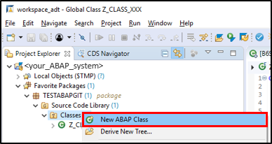
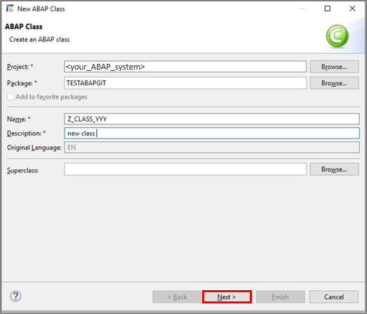
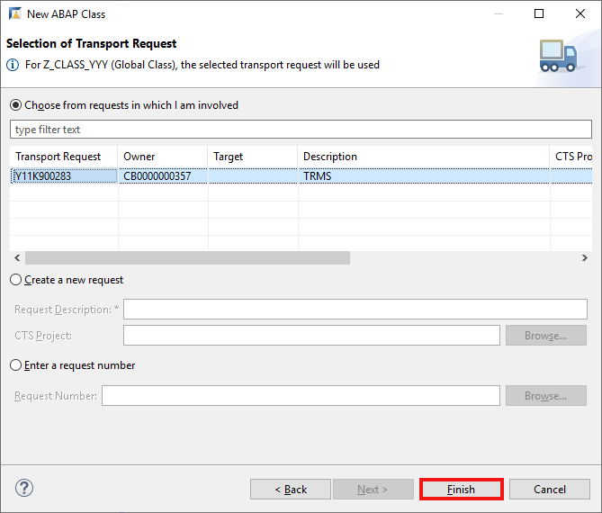
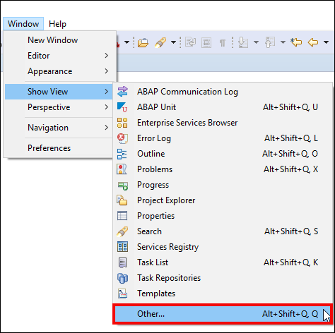
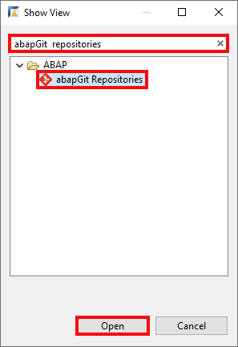
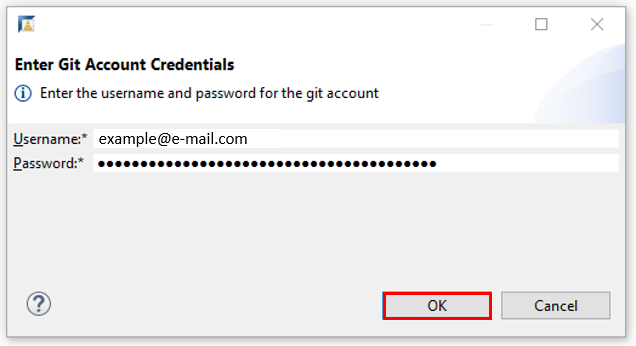
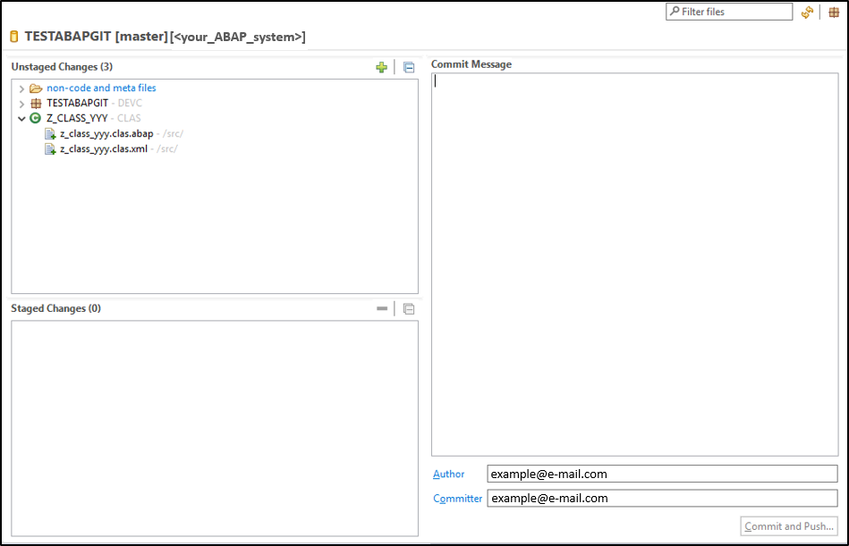
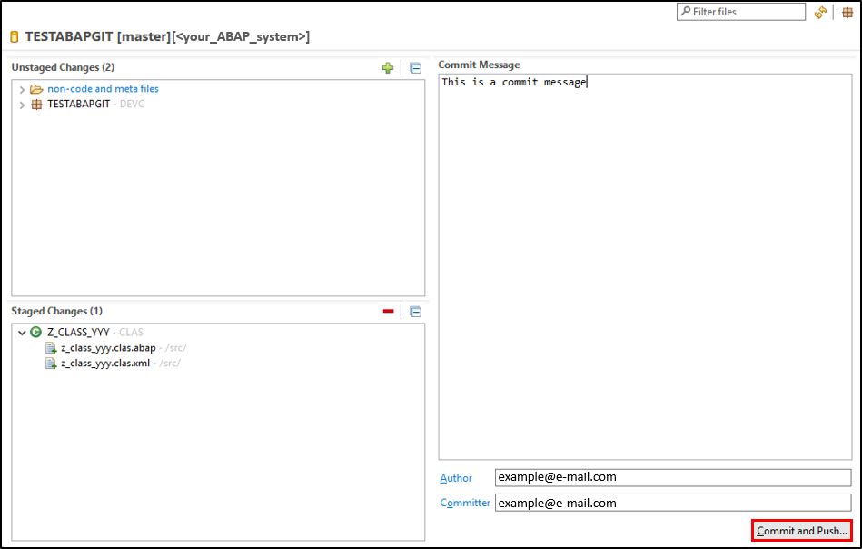
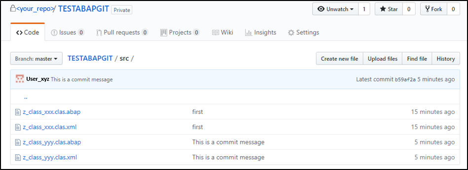

<!-- loio3d734bec294441f498880e93ed3222dd -->

# Transfer your ABAP Source Code via abapGit

Use abapGit to transfer your ABAP source code from an ABAP environment instance back to your repository.

1.  Create or adapt your source code in the ABAP environment instance:

    1.  Open **ABAP Development Tools** and logon to your ABAP system.
    2.  Add an ABAP development object, e.g. an ABAP class, to your already existing *TESTABAPGIT* package. To do this, click on *Classes* and select *New ABAP Class*.

        

    3.  Enter a name and description for your new ABAP class and click *Next*.

        

    4.  Click *Finish*.

        

    5.  Now you can implement your newly created class.

        

    6.  Save and activate.
2.  Open abapGit repositories:

    1.  Select your **ABAP system** in the Project Explorer and select *Windows* \> *Show View* \> *Other...* to open the *abapGit* repositories.

        

    2.  Search for *abapGit repositories*, select it and click *Open*.

        

3.  Stage and commit your ABAP development objects.
    1.  Right-click your *TESTABAPGIT* package and click *Stage and Push*.
    2.  Enter your repository credentials in the popup and click *OK*.

        

    3.  In the staging view you will see a list of changed, created or deleted ABAP development objects which can be transferred to your repository. The icon of the respective file indicates whether a file was created, modified, or deleted.

        

    4.  ABAP development objects which should become staged can be selected by drag and drop from the *unstaged* box to the *staged* box or by clicking on the *+* button. Enter your commit message and click**Commit and Push**.

        

    5.  You'll see a notification telling you that your push has started. Click *OK*.
    6.  The staged objects have now been transferred to your repository.

        

