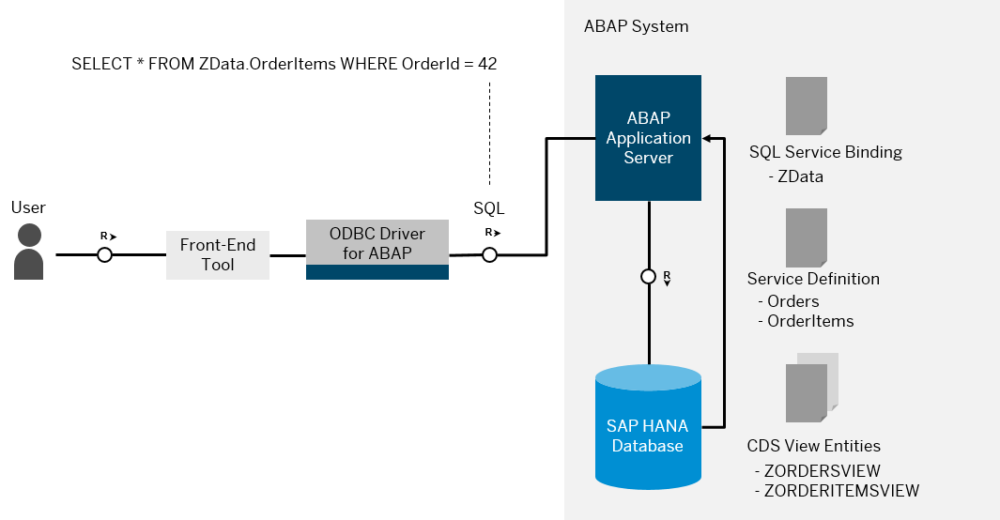

<!-- loio4082fe1b66164eeb8aa41192166526af -->

# Accessing ABAP-Managed Data from External ODBC-Based Clients

As a developer in the ABAP environment, you can access CDS view entities in an ABAP system using SQL and the open database connectivity \(ODBC\), a standard API for accessing databases. As a result, you can use SQL statements in external analytical tools to access data in database tables that reside in the ABAP environment.

<a name="loio4082fe1b66164eeb8aa41192166526af__section_vs1_2gy_vqb"/>

## Why ODBC?

There are situations where you would like to have external SQL read access to CDS objects owned by the ABAP system. Direct SQL read access to the underlying SAP HANA database of an ABAP system isn't a good choice because, for example, ABAP-level security concepts are bypassed and typecasts might not be performed as expected \(see also SAP Note [2511210](https://me.sap.com/notes/2511210)\).

Security concerns and other issues don't arise if you treat the ABAP system itself as a database by accessing the ABAP system directly using ODBC. In this case, authentication and authorization are done using an ABAP user. Full ABAP SQL semantics apply and even buffering on application server level can be used as well as ABAP-level access control and read access logging.

Compared to the ODATA interface, the ODBC interface has the advantage that it allows for unrestricted SQL access to all exposed ABAP CDS view entities. Data from different entities can be joined in an ad-hoc fashion and data can be aggregated for analytical queries.

<a name="loio4082fe1b66164eeb8aa41192166526af__section_yc3_twz_vqb"/>

## Architecture

To access database tables from external ODBC-based tools, you use the SQL service binding and the ODBC driver for ABAP as follows:

-   The ODBC driver for ABAP implements the ODBC API, which can be used by ODBC-enabled front-end tools to execute SQL queries on the SAP Application Server ABAP.

    Such a front-end tool could be a standard tool capable of loading an ODBC driver, for example, Microsoft Excel. The ODBC driver for ABAP can also be used in multiple programming languages. ODBC is primarily a C API, but other languages like node.js, Python, or Perl also provide plugins for ODBC drivers.

-   Instead of directly querying the underlying ABAP-owned database objects using the SQL layer of the ABAP system database, all SQL requests are routed through the ABAP Application Server. They behave just like they would if executed from within an ABAP program.

-   You create CDS view entities on top of the tables that you want to expose.
-   The SQL service binding type serves to expose CDS view entities as read-only to ODBC-based SQL clients. With the SQL service, you can use an access mechanism of the ABAP Application Server that provides SQL-level access to published ABAP-managed database API objects like tables and CDS views for system-external consumers.

The ODBC driver for ABAP supports the use of a communication user in the ABAP system with privileged access \(no access controls applied\). Only read access to the exposed ABAP CDS objects is allowed.

In addition to the communication user, the ODBC driver for ABAP also supports the use of a business user with a browser-based logon. The ABAP system forwards the user’s logon request to the configured identity provider to handle it. Authorizations for business users to view data can be limited using restriction types.

The ODBC driver for ABAP is available on Windows and Linux.

You can access the data as read-only using an external ODBC-based client tool, including loading the data into the client tool and searching for data using embedded SQL queries. The ODBC-based client can be any client tool capable of loading an ODBC driver, such as Microsoft Excel or LibreOffice.

<a name="loio4082fe1b66164eeb8aa41192166526af__section_dsr_lzz_1tb"/>

## Additional Information

This documentation leads you through the necessary development, installation, and configuration for the consumption of the SQL service and ODBC driver. If you prefer to follow a tutorial instead, you can also use the following \(for a communication user with privileged access only\):

[https://developers.sap.com/tutorials/abap-environment-abap-sql.html](https://developers.sap.com/tutorials/abap-environment-abap-sql.html)

