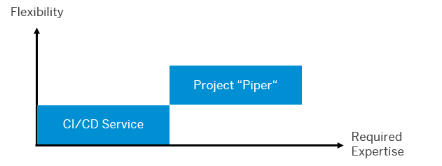

<!-- loiofdead30953d24c0ca75768e2c3bcdd2c -->

# Continuous Integration and Delivery

Learn how to integrate CI/CD into your development with the SAP Cloud Application Programming Model \(CAP\).

 <a name="loio31cbeccf367e465fa3fc83e367c9c6f1"/>

<!-- loio31cbeccf367e465fa3fc83e367c9c6f1 -->

## What Are Continuous Integration and Delivery?

**Continuous integration \(CI\)** describes a software development process in which various team members integrate their contributions frequently into a single main line. Before each integration, the changes are verified through builds and automated testing. Thereby, you can detect errors as quickly as possible and prevent integration problems before completing the development.

### Continuous Integration Basic Flow

The continuous integration basic flow comprises the following steps:

1.  **The developer writes code and pushes the code changes into a central source code management system \(SCM\).**

2.  The SCM triggers the continuous integration \(CI\) server.

3.  The CI server runs automated builds and tests and sends feedback about their outcome to the developer.

### Continuous Integration Basic Flow

The continuous integration basic flow comprises the following steps:

1.  The developer writes code and pushes the code changes into a central source code management system \(SCM\).

2.  **The SCM triggers the continuous integration \(CI\) server.**

3.  The CI server runs automated builds and tests and sends feedback about their outcome to the developer.

### Continuous Integration Basic Flow

The continuous integration basic flow comprises the following steps:

1.  The developer writes code and pushes the code changes into a central source code management system \(SCM\).

2.  The SCM triggers the continuous integration \(CI\) server.

3.  **The CI server runs automated builds and tests and sends feedback about their outcome to the developer.**

As you can see from the graphic, the basic flow for continuous integration is a cycle: As soon as the CI server has sent its feedback to the developer, the flow starts over again. The developer either corrects his or her previous code change, which must then be built and tested again, or starts working on an entirely new one.

The **continuous delivery \(CD\)** concept expands on the one of continuous integration. It adds the aspect that any change that has successfully passed the tests is immediately ready to be deployed to production, both from a technical and a qualitative point of view.

The following graphic shows the relation between continuous integration and continuous delivery:

   
  
**Relation Between CI and CD**

  

The continuous delivery process makes sure that the most current version of the software product is successfully built, tested, and provided in a shippable format. Based on the release decision by the development team or delivery manager, it can be shipped to customers or deployed to production at any time.

For more information about the concepts and principles of continuous integration and delivery, see the [Continuous Integration and Delivery Introduction Guide](https://help.sap.com/viewer/Continuous-Integration-and-Delivery-Introduction-Guide/7fc38a80cda446ef856c01f748dbede8.html).

 <a name="loio862ec834e72842a6b027d8d1518055dd"/>

<!-- loio862ec834e72842a6b027d8d1518055dd -->

## CI/CD Solutions by SAP for the SAP Cloud Application Programming Model

SAP offers two different solutions that help you apply CI/CD in your development with the SAP Cloud Application Programming Model \(CAP\):

-   [**SAP Continuous Integration and Delivery**](https://help.sap.com/viewer/product/CONTINUOUS_DELIVERY/Cloud/en-US) is a service on SAP BTP, which lets you configure and run predefined CI/CD pipelines that test, build, and deploy your code changes.

-   [**Project “Piper”**](http://help.sap.com/disclaimer?site=https://sap.github.io/jenkins-library/) is an open-source project that provides preconfigured Jenkins pipelines, which you can use in your own Jenkins infrastructure and adapt according to your needs, if necessary. It consists of a [shared library](http://help.sap.com/disclaimer?site=https://github.com/SAP/jenkins-library), which contains the description of steps, scenarios, and utilities required to use Jenkins pipelines, and a [set of Docker images](http://help.sap.com/disclaimer?site=https://github.com/SAP/devops-docker-images) that can be used to implement best practice processes.

Both solutions offer in their level of flexibility and expertise required for setup and configuration:

> ### Note:  
> In the following image, click on one of the blue boxes to navigate to the corresponding solution.

As you don’t need to care about the underlying infrastructure, SAP Continuous Integration and Delivery requires the least expertise in CI/CD. Therefore, however, its flexibility is limited. Project “Piper” Docker images can be used out-of-the-box. However, this offering depends on Jenkins as underlying CI/CD tool.

For more information about the CI/CD solutions by SAP, see [SAP Solutions for Continuous Integration and Delivery](https://help.sap.com/viewer/Continuous-Integration-and-Delivery-by-SAP).

The following links guide you to the SAP Cloud Application Programming Model \(CAP\) sections of our CI/CD solutions:

**CI/CD for CAP Development**

<table>
<tr>
<th valign="top">

CI/CD Solution

</th>
<th valign="top">

CAP Section

</th>
<th valign="top">

Description

</th>
</tr>
<tr>
<td valign="top">

SAP Continuous Integration and Delivery

</td>
<td valign="top">

 [sap-cloud-sdk](https://help.sap.com/viewer/SAP-Cloud-Platform-Continuous-Integration-and-Delivery/bfe48a4b12ed41868f92fa564829f752.html) 

</td>
<td valign="top">

Configure a CI/CD pipeline for the development of applications that follow the SAP Cloud Application Programming Model in the Cloud Foundry environment.

</td>
</tr>
<tr>
<td valign="top">

Project “Piper”

</td>
<td valign="top">

 [Build and Deploy SAP Cloud Application Programming Model Applications](https://sap.github.io/jenkins-library/scenarios/CAP_Scenario/) 

</td>
<td valign="top">

Set up a CI/CD Pipeline for an SAP Cloud Application Programming Model \(CAP\) project.

</td>
</tr>
</table>

