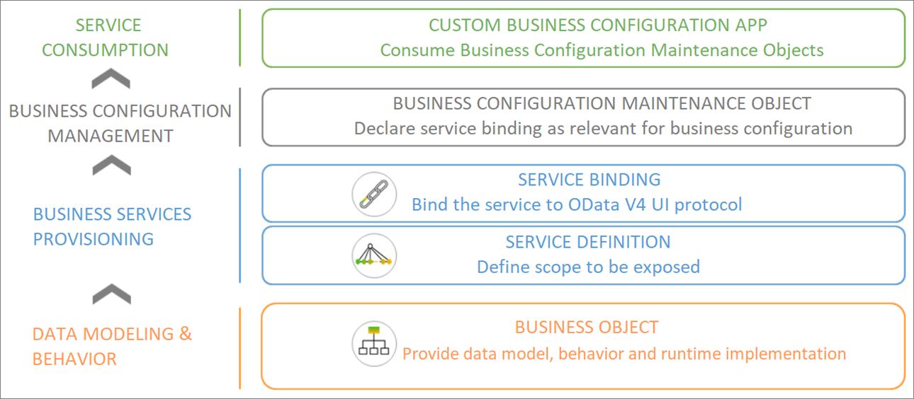

<!-- loiofa420dd6272b41858a7b31f8dc5090f8 -->

# Creating Business Configuration Apps with ABAP RESTful Application Programming Model and Custom Business Configurations App

As an ABAP Developer you can leverage the *ABAP RESTful Application Programming Model* \(RAP\) and the *Custom Business Configurations* \(CUBCO\) app to create a SAP Fiori UI to maintain customizing table data. You don’t need to create your own Fiori app. Everything can be implemented with ABAP repository objects.

For more information, see this [tutorial](https://developers.sap.com/group.abap-env-factory.html).

  

The development of a business configuration maintenance Fiori UI requires developers to perform the following fundamental activities:

<a name="loiofa420dd6272b41858a7b31f8dc5090f8__section_uhj_sjk_s5b"/>

## 1. Developing Business Object

Based on the customizing tables you define a data model and business object structure. Check the prerequisites of the business configuration maintenance object to see which kind of business object is supported. Using model-driven development approach, you develop actions, validations, and determinations for the entities of the business object to change, maintain and validate configuration entries.

You have the option to use the [Generate ABAP Repository Objects Wizard](https://help.sap.com/docs/BTP/65de2977205c403bbc107264b8eccf4b/047e01c3bcdd4303a60b61364bd5b31d.html) to generate all required development objects based on a customizng table. If required, you can then add further functions or enhance the generated business object structure.

For more information, see [Developing a Ready-to-Run Business Object](https://help.sap.com/docs/BTP/923180ddb98240829d935862025004d6/87fae4292b1e4c88a863377fb3620b47.html) and [Developing Business Logic](https://help.sap.com/docs/BTP/923180ddb98240829d935862025004d6/b77bd60fff914841a9c55d7e7a9b4b27.html).

<a name="loiofa420dd6272b41858a7b31f8dc5090f8__section_r5n_1nk_s5b"/>

## 2. Developing Business Service

Define the scope by exposing the entities of the business object in a service definition and bind the service to OData V4 UI protocol with a service binding. For more information on this, see [Working with Business Services](https://help.sap.com/docs/BTP/f859579898c7494dbe2449bb7f278dcc/275ae38b770e4a15b8ea026d5185e1a3.html?version=Cloud).

<a name="loiofa420dd6272b41858a7b31f8dc5090f8__section_fbx_gnk_s5b"/>

## 3. Developing Business Configuration Maintenance Object

Declare the service binding as relevant for business configuration by creating a [Business Configuration Maintenance Object](business-configuration-maintenance-object-61159c4.md).

<a name="loiofa420dd6272b41858a7b31f8dc5090f8__section_jf3_lnk_s5b"/>

## 4. Custom Business Configurations App

Based on the Business configuration maintenance object, the custom business configurations app renders a [Fiori Elements List Report Floorplan](https://experience.sap.com/fiori-design-web/list-report-floorplan-sap-fiori-element/) for the entities exposed by the service binding to maintain the configuration entries. For more information, see [Custom Business Configurations App](../50-administration-and-ops/custom-business-configurations-app-76384d8.md).

