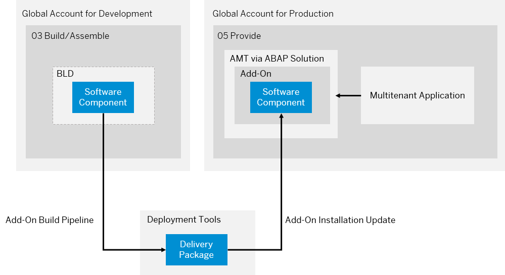
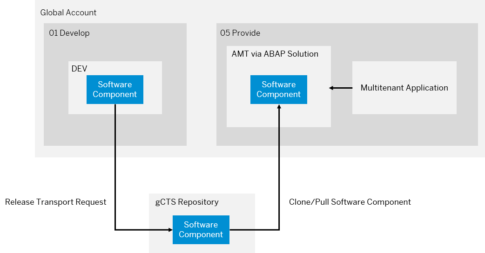

<!-- loio438d7ebfdc4a41de82dcdb156f01857e -->

# Delivery via Add-On or gCTS

For SaaS solutions in the ABAP environment, software components including ABAP development objects have to be delivered to your production system. This is referred to as upstream process.

Afterwards, the SaaS solution is provided by offering a multitenant application that facilitates a subscription mechanism. This is referred to as downstream process.

There are multiple options to deliver software components to the systems. The delivery process described in this documentation mainly focuses on using add-on products as a means to deliver software components by installing or updating delivery packages in a system. See [The Add-On Product](https://www.project-piper.io/scenarios/abapEnvironmentAddons/#the-add-on-product).

As an alternative, you can choose a delivery process using the gCTS-transport-based import of software components. See [Transport Mechanisms](transport-mechanisms-aa7f169.md).

<a name="loio438d7ebfdc4a41de82dcdb156f01857e__section_uv2_jzr_2rb"/>

## Add-On Build Delivery Process

An add-on is a bundle of software components. To create an add-on, a build process orchestrated by an add-on build pipeline has to be triggered.

With delivery tools, the software components are packaged into deliveries that are then further processed. Eventually, the deliveries are stored as delivery packages using the deployment tools provided by SAP.

Add-on deployment is either performed by using an add-on installation during system provisioning or as an add-on update triggered in the *Landscape Portal* application.

Delivery packages are of different types, which means that the build and deployment of these packages differ accordingly. For example, the import of a software component for an add-on installation package or delta-import for correction packages.

BLD and AMT systems are based on different service plans: `abap/standard` for a plain ABAP system and `abap/saas_oem` for an ABAP system with installed add-on. The usage of these service plans is separated in two different global accounts for development and production purposes. Making software components available across different global accounts is only possible by using the add-on delivery process.

Making software components available across different global accounts is only possible by using the add-on delivery process. You can't use software components imported via add-on in the *Manage Software Components* app.

<a name="loio438d7ebfdc4a41de82dcdb156f01857e__section_byp_kzr_2rb"/>

## gCTS Transport Delivery Process

The gCTS-transport-based delivery process takes place in one global development account only. This is due to the fact that the underlying gCTS repository is only shared among systems in the same region in the same global account.

ABAP development objects are released with a transport request in a particular software component in the development system. The transport request release automatically exports the changes into an SAP-managed gCTS repository by creating a new commit. Once the changes are exported into the gCTS repository, they are centrally available and can be imported into any other systems in the same region in the same global account. By cloning a software component into a customer production system using the *Manage Software Components* app, implemented ABAP objects become available to customers subscribed to the multitenant application.

The customer production system AMT is provisioned during the initial subscription to the multitenant application. Since the SaaS solution needs to include the implemented software, software components must be cloned right after the first subscription.

<table>
<tr>
<td valign="top">

 

</td>
<td valign="top">

**Add-On Build Delivery \(Productive Build Pipeline\)** 

</td>
<td valign="top">

**gCTS Transport Delivery \(Transport Mechanism\)**

</td>
</tr>
<tr>
<td valign="top">

**System Landscape/Account Model**

</td>
<td valign="top">

-   ABAP systems for development purposes \(development, test, demo\) are of type `abap/standard` or `abap/ abap_saas_oem`, and are provisioned in the global account for development based on a discounted development license
-   ABAP systems for production purposes \(used by partner customers\) are of type `abap/standard` or `abap/ abap_saas_oem`, and are provisioned in the global account for production based on a production license
-   Software components are made available across these different global accounts by using add-ons
-   For execution of the add-on build pipeline, an add-on assembly system BLD and add-on installation test system ATI are \(temporarily\) required

</td>
<td valign="top">

-   All ABAP systems are of type `abap/standard` and are provisioned in the same global account
-   No additional ABAP systems, apart from already existing development and test systems, are required to facilitate the delivery
-   Single global account because gCTS repositories are only shared among ABAP systems in the same region in the same global account

</td>
</tr>
<tr>
<td valign="top">

**Ease of Use**

</td>
<td valign="top">

-   Initial efforts to set up ABAP environment pipeline for add-on build
-   ABAP environment pipeline needs to be executed in a Jenkins CI/CD Server
-   Initial configuration effort and requires to set up Jenkins server infrastructure. See [Infrastructure](https://www.project-piper.io/infrastructure/overview/).
-   Resulting delivery packages are either installed as part of an add-on during system provisioning or updated centrally in the systems using the *Landscape Portal* application. See [Perform Add-on Updates](perform-add-on-updates-8c5cb9e.md).

</td>
<td valign="top">

-   No build process required; deployment triggered locally using *Manage Software Components* app
-   Changes to software components are released and exported to a central remote repository using transport requests
-   The *Manage Software Components* app, that is part of every ABAP system, is used to trigger the import of new changes locally for each system
-   As an alternative, software component import can be triggered by using the ABAP environment pipeline. See [ABAP Environment Pipeline](https://www.project-piper.io/pipelines/abapEnvironment/introduction/).

</td>
</tr>
<tr>
<td valign="top">

**Quality Measures/Resilience**

</td>
<td valign="top">

Add-on build pipeline for delivery to production provides a guided process with strict checks:

-   ABAP Test Cockpit checks before transport release
-   Optional: ABAP Test Cockpit checks as part of ABAP environment pipeline for continuous testing
-   ABAP Test Cockpit checks as part of ABAP environment pipeline for add-on build
-   Checks during add-on build
-   Add-on installation test
-   Check for minimum platform version during add-on installation/update
-   Checks for import conditions during add-on installation/update that prevent import of unwanted software component states

</td>
<td valign="top">

gCTS transport includes basic checks, for strict checks additional processes need to be established:

-   ABAP Test Cockpit checks before transport release
-   Optional: ABAP Test Cockpit checks as part of ABAP environment pipeline for continuous testing

</td>
</tr>
<tr>
<td valign="top">

**Auditability/Traceability**

</td>
<td valign="top">

-   Reliable, secure, traceable, and automated process based on add-on build using ABAP environment pipeline
-   Resulting delivery packages created as part of add-on build are signed and stored permanently so that they can't be altered or deleted after a release
-   Import conditions are assigned to delivery packages so that it’s technically verified, during add-on update/installation, that all prerequisite package requirements are met
-   Delivery packages can be traced back to a specific commit ID of a software component, also dependencies between delivery packages can be translated into dependencies between different commit IDs
-   Build logs are archived as part of the add-on build pipeline execution
-   Anonymization of build results \(*Created by* information\)
-   Add-on build pipeline guarantees that only tested changes are delivered to consumers

</td>
<td valign="top">

-   Logs of software component import are not archived, only locally available in ABAP environment system
-   Commit IDs in software component branches can be deleted by accident if not contained in any other existing branch
-   Import dependencies between software components need to be taken care of manually, a specific import order must be adhered to
-   Software component states are only identified by a specific commit ID instead of a readable version number

</td>
</tr>
<tr>
<td valign="top">

**Scalability**

</td>
<td valign="top">

-   Online deployment only possible with add-on-based delivery
-   With the *Landscape Portal* as a central tool for orchestration of software lifecycle activities, the add-on version can be updated centrally in multiple systems at the same time
-   Add-ons are automatically installed during system provisioning of ABAP systems and application content is immediately available in systems after subscription to the multitenant application

</td>
<td valign="top">

-   Application content is initially not available: Software components need to be cloned locally into the provisioned systems using the *Manage Software Components* app. See [How to Clone Software Components](../50-administration-and-ops/how-to-clone-software-components-18564c5.md).

    > ### Note:  
    > You can use a separate test subscription that is not related to a consumer to trigger the creation of the system before the consumer subscribes to the solution. This initial system creation and import of the software components needs to be performed for each consumer production system.

-   Latest changes can be pulled locally into a system by using the *Manage Software Components* app. See [How to Pull Software Components](../50-administration-and-ops/how-to-pull-software-components-90b9b9d.md).
-   Software component states installed in a system can only be identified locally in the *Manage Software Components* app.

    > ### Note:  
    > Especially for SaaS solutions deployed using multiple ABAP environment systems, a gCTS-transport-based delivery process results in a lot of manual effort.

</td>
</tr>
<tr>
<td valign="top" rowspan="2">

 **Certifications and Compliance of Solution**

</td>
<td valign="top" colspan="2">

SAP Compliance Offerings available in SAP Trust Center. See [https://www.sap.com/about/trust-center/certification-compliance.html](https://www.sap.com/about/trust-center/certification-compliance.html).

</td>
</tr>
<tr>
<td valign="top">

Requires less effort to be compliant because a strict process, supported by SAP delivery/deployment tools, is provided.

</td>
<td valign="top">

Requires additional effort to to be compliant because a strict process needs to be established without SAP tooling support.

</td>
</tr>
</table>

> ### Recommendation:  
> We recommend using the **add-on build delivery** process because it offers a bundling that can be used to implement a sophisticated delivery approach with separate codelines, versioning, and, as a result, different delivery package types. See [Delivery Models](versioning-and-branches-8c087bc.md#loio326508756a144c49b98e5fcf442cce40). It also comes with a separation of ABAP system licenses for development and production purposes, with the development systems being available at a discounted rate.
> 
> Example scenarios: Long-term projects with frequent maintenance deliveries, expected growth of consumers over time, and adherence to specific standards/certifications.
> 
> The **gCTS transport delivery** approach is a more lightweight approach that might be used especially if a simple setup and quick readiness are important. Ease-of-use of the approach comes with disadvantages in auditability, traceability, scalability, and resilience. These trade-offs might be resolved by establishing additional manual process steps or documentation requirements.
> 
> If the multitenant application is configured with `tenant_mode = single`, a dedicated system is created per subscription. See [Define Your ABAP Solution](define-your-abap-solution-1697387.md). In that case, gCTS delivery is only recommended if the SaaS solution is expecting a small set of customers or if the subscription is performed together with the customer. Otherwise, the effort for executing manual tasks, such as importing software components would be too high.
> 
> Example scenarios: Prototyping projects, quick time-to-market launch, in-house solutions, predictable number of consumers, and no expected exceptional growth rate
> 
> Once a first customer is using the SaaS solution and a first production system is provisioned, there is no migration path available to switch from one approach to the other, which means that systems would have to be deleted. However, it is likely is to start out with gCTS transport delivery in the prototyping phase of a project and establish an add-on build delivery approach once the initial version needs to be delivered and customer systems need to be created.

