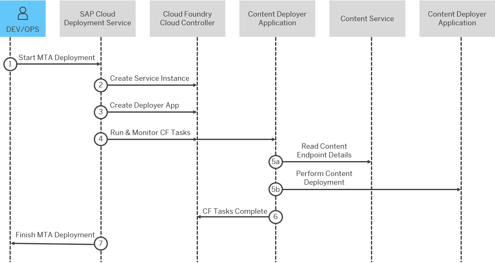

<!-- loio98b1bf56f37a4df8a76e9a094db8c134 -->

# Deploying Content with CF Task Execution

This approach for content deployment relies on an intermediate Cloud Foundry application that communicates with the content backend. This application includes both the content and the content specific deployer.

The content specific deployer is defined as an application dependency during design time. It is then included in the MTA archive. During deployment it serves as a client for the actual content deployment to the content backend.

> ### Note:  
> This approach is a natural successor to [Deploying Content with Simulated App Execution](deploying-content-with-simulated-app-execution-9454b1f.md). When possible, it is recommended to use the current approach instead of the legacy one. Normally, there is only one dedicated content deployer for each content type that handles both approaches.


<a name="loio98b1bf56f37a4df8a76e9a094db8c134__section_tb4_vtp_wxb"/>

## Supported Content Types

Supported content types that currently allow deployment with CF Task execution:

-   HDI content - MTA module type `com.sap.xs.hdi`. For more information see [The SAP HDI Deployer](https://help.sap.com/docs/HANA_CLOUD_DATABASE/b9902c314aef4afb8f7a29bf8c5b37b3/1b567b05e53c4cb9b130026cb2e7302d.html)

-   FLP content – MTA module type `com.sap.portal.content`
-   Business Logging - MTA module type `com.sap.business-logging.content`. For more information see [Using the Content Deployer](https://help.sap.com/docs/SAP_CP_BUS_REUSE_SERVICE_BL/9d9c6578dd284b7491e2b6ceb1395329/626b5511d7924ace8b6ae912e8ff3447.html?locale=en-US)
-   HTML5 Content – MTA module type `com.sap.html5.application.content`. For more information see [Deploy Content Using HTML5 Application Deployer](https://help.sap.com/docs/btp/sap-business-technology-platform/deploy-content-using-html5-application-deployer?version=Cloud)


<a name="loio98b1bf56f37a4df8a76e9a094db8c134__section_znc_m5p_wxb"/>

## How Content is Deployed with CF Task Execution

The following diagram illustrates the steps and BTP components involved in the process of content deployment with CF task execution:



The following steps describe the process of content deployment with CF Task execution:

1.  A developer/operator runs MTA deployment

2.  SAP Cloud Deployment service creates or reuses a service instance provided by an SAP application

3.  During this step:

    1.  SAP Cloud Deployment service creates a Cloud Foundry application that serves as a content application

    2.  SAP Cloud Deployment service binds the service instance to the content application

    3.  SAP Cloud Deployment service uploads the combination of content and content deployer as application bits


4.  SAP Cloud Deployment service runs CF tasks, including the one responsible for actual content deployment

5.  The dedicated CF task of content application triggers content deployer, which in turn performs the actual content deployment. During this step:

    1.  CF task reads content details from the bound service instance and identifies the content endpoint as well as the required authentication

    2.  CF task executes the content deployment to the content endpoint


6.  CF task completed successfully

7.  MTA deployment completes and SAP Cloud Deployment service reports the status to the developer/operator


<a name="loio98b1bf56f37a4df8a76e9a094db8c134__section_vxh_rwp_wxb"/>

## Content Deployer and Service Instance

The Content Deployer and Service Instance follow the same rules as the ones from [Deploying Content with Simulated App Execution](deploying-content-with-simulated-app-execution-9454b1f.md).


<a name="loio98b1bf56f37a4df8a76e9a094db8c134__section_a1f_1xp_wxb"/>

## CF Tasks

Tasks are native to Cloud Foundry and are valuable in various scenarios which demand one-off jobs. For more information see[https://help.sap.com/docs/btp/sap-business-technology-platform/tasks?version=Cloud](https://help.sap.com/docs/btp/sap-business-technology-platform/tasks?version=Cloud) from the official documentation.

CF tasks, dedicated for content deployment, are predefined from the SAP Cloud Deployment service and must not be changed by the end customer. They are represented by the module level parameter `tasks`.


<a name="loio98b1bf56f37a4df8a76e9a094db8c134__section_yfg_jfq_wxb"/>

## MTA Modelling

Below you can find the modelling for supporting the content deployment scenariofor MTA module type `com.sap.xs.hdi`:

> ### Sample Code:  
> ```
> _schema-version: "3.1" 
> ID: my.app 
> version: "1.1" 
> - name: module-db 
>     type: com.sap.xs.hdi 
>     parameters: 
>       buildpack: nodejs_buildpack //Predefined parameter 
>       no-route: true  // Predefined parameter - skipping route mapping to the app 
>       no-start: true // Predefined parameter - skipping start of the app because only tasks are important in the scenario 
>       memory: 256M // Predefined parameter 
>       tasks: // Predefined parameter – all details below define the CF tasks 
>         - name: deploy 
>           memory: 256M 
>           command: npm start // Shell script that will be used for triggering actual content deployment 
>     properties: 
>       EXIT: 1 // Predefined property – instructs the HDI deployer to exit when done 
>     requires: 
>       - name: hdi-service 
>  
> resources: 
>   - name: hdi-service // Provides content endpoint for the actual content deployment. Content endpoint could be different based on the used database 
>     type: com.sap.xs.hdi-container
> 
> ```

