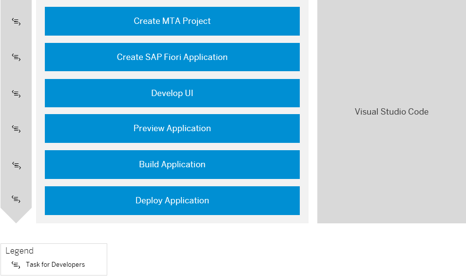

<!-- loio2498cbfce1b14f3b9f62fab9fa4407f7 -->

# Develop an SAP Fiori Application and Deploy it to Cloud Foundry

Get an overview about how to create and deploy an SAP Fiori application to Cloud Foundry using SAP Business Application Studio or Microsoft Visual Studio Code \(VS Code\).

<a name="loio2498cbfce1b14f3b9f62fab9fa4407f7__section_vrs_rsc_jsb"/>

## Prerequisites for UI Development with SAP Business Application Studio

-   An account administrator has to subscribe to SAP Business Application Studio and assign permissions. See [Setup of UI Development in SAP Business Application Studio \(Optional\)](../20-getting-started/setup-of-ui-development-in-sap-business-application-studio-optional-37a896b.md).
-   You have to create a dev space. See [Working in the Dev Space Manager](https://help.sap.com/products/SAP%20Business%20Application%20Studio/9d1db9835307451daa8c930fbd9ab264/ad40d52d0bea4d79baaf9626509caf33.html).

-   You have access to a RAP business service that has been exposed as an OData service. See [Using Service Binding Editor for OData V2 Service](https://help.sap.com/viewer/923180ddb98240829d935862025004d6/Cloud/en-US/81dc788fbda74883bd775a4036fa4b67.html).
-   Your administrator has created a destination to the ABAP system to integrate SAP Business Application Studio. See [Creating a Destination to the ABAP System for SAP Business Application Studio](../20-getting-started/creating-a-destination-to-the-abap-system-for-sap-business-application-studio-e597948.md).
-   Business catalog `SAP_CORE_BC_EXT_TST` is assigned to your user, which allows you to preview your application and discover available OData services. See [Business Catalog for Key User Tasks](../50-administration-and-ops/business-catalog-for-key-user-tasks-65b70bf.md).
-   Business catalog `SAP_A4C_BC_DEV_UID_PC` is assigned to your user, which allows you to deploy your application. See [Business Catalogs for Development Tasks](../50-administration-and-ops/business-catalogs-for-development-tasks-a9f4278.md).

<a name="loio2498cbfce1b14f3b9f62fab9fa4407f7__section_rsw_ntc_jsb"/>

## Prerequisites for UI Development with Microsoft Visual Studio Code

-   You have installed Microsoft Visual Studio Code including the SAP Fiori tools extensions. See [Visual Studio Code](https://help.sap.com/viewer/17d50220bcd848aa854c9c182d65b699/Latest/en-US/17efa217f7f34a9eba53d7b209ca4280.html).
-   Business catalog `SAP_CORE_BC_EXT_TST` is assigned to your user, which allows you to preview your application and discover available OData services. See [Business Catalog for Key User Tasks](../50-administration-and-ops/business-catalog-for-key-user-tasks-65b70bf.md).
-   Business catalog `SAP_A4C_BC_DEV_UID_PC` is assigned to your user, which allows you to deploy your application.
-   You have access to a RAP business service that has been exposed as an OData service. See [Using Service Binding Editor for OData V2 Service](https://help.sap.com/viewer/923180ddb98240829d935862025004d6/Cloud/en-US/81dc788fbda74883bd775a4036fa4b67.html).
-   To access your service, you have to select an ABAP environment definition source
    -   \(Option 1\): Discover a Cloud Foundry Service
        -   You have to be a space developer to access the service key
        -   You have to be logged on to the SAP BTP cockpit and navigate to your subaccount and space
        -   You have to access the service instance and connect to the corresponding system, and select the service name

    -   \(Option 2\): Upload a Service Key File
        -   You have to be a space developer to access the service key
        -   You have to save the service key, and upload it in VS Code.In the Logon section, an integrated browser is opened where you must provide the logon details.

<a name="loio2498cbfce1b14f3b9f62fab9fa4407f7__section_dvd_t3k_hmb"/>

## Generating and Deploying Your Application

1.  Create an MTA project with approuter configuration.
    1.  To create an MTA with approuter configuration, use the*Fiori CF Application Router Generator*. See [Generate an MTA Deployment File](https://help.sap.com/viewer/17d50220bcd848aa854c9c182d65b699/Latest/en-US/9c41152c5b8d4a658d7ef9f318b28917.html).

        This generates an MTA project and the corresponding application router configuration.

    2.  To create an SAP Fiori application in the subfolder of the MTA file location, use the *SAP Fiori Generator*. See [Generate an Application](https://help.sap.com/viewer/17d50220bcd848aa854c9c182d65b699/Latest/en-US/db44d45051794d778f1dd50def0fa267.html) and [Add a Fiori Application to an MTA Deployment File with the Fiori Generator](https://help.sap.com/viewer/17d50220bcd848aa854c9c182d65b699/Latest/en-US/5a17ba6b62b2462aa0e25ffae7b8d728.html).
        -   As a data source, select *Connect to a System*.
        -   As a system, choose the destination to the ABAP system that has been created to integrate SAP Business Application Studio.
        -   As a service, select your RAP business service that has been exposed as an OData service

    3.  Add an SAP Fiori launchpad configuration for your UI project. See section *Add FLP configuration* in [Additional Configuration](https://help.sap.com/viewer/17d50220bcd848aa854c9c182d65b699/Latest/en-US/9bea64e63b824261932d90037ce3c5ae.html).

        If you want to create you FLP configuration later, see [SAP Fiori Launchpad Configuration](https://help.sap.com/viewer/17d50220bcd848aa854c9c182d65b699/Latest/en-US/bc3cb890dbb84d51ae80394821ce4990.html).

2.  Continue with the development of the UI, for example, with the help of guided development. See [Implement Features using Guided Development](https://help.sap.com/viewer/17d50220bcd848aa854c9c182d65b699/Latest/en-US/0c9e518ecf704b2f80a2bed0eaca60ae.html).
3.  Now you can preview the generated SAP Fiori application. See [Preview an Application](https://help.sap.com/viewer/17d50220bcd848aa854c9c182d65b699/Latest/en-US/b962685bdf9246f6bced1d1cc1d9ba1c.html).
4.  Build the application by executing command ***npm run build*** in the terminal of your project. See section *Deployment to Cloud Foundry* in [Deployment of Application](https://help.sap.com/viewer/17d50220bcd848aa854c9c182d65b699/Latest/en-US/607014e278d941fda4440f92f4a324a6.html).

    This generates an `*.mtar` file and `mta_archives` folder.

5.  Log on to Cloud Foundry and deploy the SAP Fiori UI to your development space by executing command ***npm run deploy***. See section *Deployment to Cloud Foundry* in [Deployment of Application](https://help.sap.com/viewer/17d50220bcd848aa854c9c182d65b699/Latest/en-US/607014e278d941fda4440f92f4a324a6.html).

> ### Recommendation:  
> We recommend using the same UI5 version that is being used by the ABAP environment system.
> 
> To check the UI5 version in the SAP Fiori launchpad of your ABAP environment system, use command ***Alt+Ctrl+Shift+P*** or navigate to the user actions menu and select *About*. See [User Actions Menu](https://help.sap.com/viewer/fd8f9fda63fa4c7a92bb1d4b4ac5582c/Cloud/en-US/27834b1aacf344f38910686d8fb0eb0a.html "The user actions menu offers user-related options e.g. to open apps, to change the launchpad layout or to contact support.") :arrow_upper_right:.

> ### Tip:  
> If you're experiencing issues with previewing your application, ask your account administrator to check the business role assignments. See [Assigning the ABAP Developer User to the ABAP Developer Role](https://help.sap.com/products/BTP/65de2977205c403bbc107264b8eccf4b/13b2cfb49c8046d8a031e137b6142127.html?version=Cloud).

**Related Information**  

[SAP Business Application Studio](https://help.sap.com/viewer/product/SAP%20Business%20Application%20Studio/Cloud/en-US)

[Setup of UI Development in SAP Business Application Studio](https://help.sap.com/viewer/65de2977205c403bbc107264b8eccf4b/Cloud/en-US/37a896bfac604076ae825a1d37b0bd0a.html)

[SAP Fiori Tools](https://help.sap.com/viewer/product/SAP_FIORI_tools/Latest/en-US)

[SAP Fiori Overview](https://help.sap.com/viewer/product/SAP_FIORI_OVERVIEW/5_OVERVIEW/en-US?task=discover_task)

[SAP Launchpad Service](https://help.sap.com/viewer/8c8e1958338140699bd4811b37b82ece/Cloud/en-US/9db48fa44f7e4c62a01bc74c82e74e07.html)

