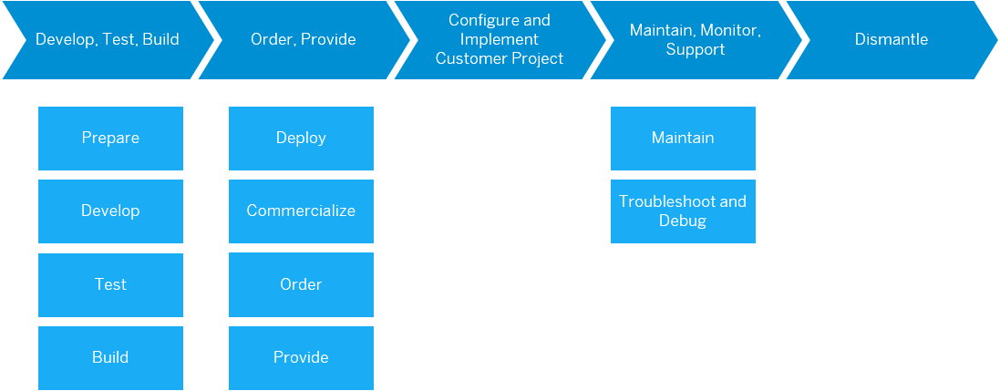

<!-- loioe3c38ebaefc44523b679e7a0c375bc86 -->

# Developing and Operating SaaS Applications

Learn how to develop and operate SaaS applications by using add-ons in the ABAP environment.

<a name="loioe3c38ebaefc44523b679e7a0c375bc86__section_lkq_q35_rnb"/>

## Introduction

The ABAP environment allows you to leverage existing ABAP know-how to create custom add-ons directly in the cloud. This add-on build process is orchestrated by using the ABAP environment. Delivery tools, such as the Add-on Assembly Kit as a Service for the registration and publishing of the add-on as a software product, and deployment tools to carry out test installations and to make the add-on available for productive use, simplify this process. See [Delivery Tools](https://www.project-piper.io/scenarios/abapEnvironmentAddons/#delivery-tools) and [Deployment Tools](https://www.project-piper.io/scenarios/abapEnvironmentAddons/#deployment-tools).

> ### Note:  
> You should only consider using add-on delivery if you intend to offer a Software as a Service \(SaaS\) solution.

Following the add-on build process, you can develop a multitenant application to share the add-on with multiple consumers \(tenants\) simultaneously. See [Developing Multitenant Applications in the ABAP Environment](developing-multitenant-applications-in-the-abap-environment-195031f.md). The application is registered with the Software-as-a-Service provisioning service \(saas-registry\) to make the application available for subscription to consumers. See [Register the Multitenant Application to the SaaS Provisioning Service](https://help.sap.com/viewer/65de2977205c403bbc107264b8eccf4b/Cloud/en-US/3971151ba22e4faa9b245943feecea54.html).

In this context, the [ABAP Solution Service](abap-solution-service-4370115.md) accounts for the provisioning of new ABAP service instances, including the installation of the add-on, and the creation of tenants whenever required for a new consumer subscription.

The way ABAP service instances and tenants are used for consumer subscription applications can be configured as follows:

-   **Single-tenant enabled**: With each new consumer, a new ABAP service instance is created
-   **Multi-tenant enabled**: For multiple consumers, the same ABAP service instance is used

<a name="loioe3c38ebaefc44523b679e7a0c375bc86__section_mcg_pgt_rnb"/>

## What Is This Guide About?

This guide describes the end-to-end process of developing and offering a SaaS solution using the ABAP environment. The following chapters cover all aspects of this scenario, from the initial setup and development tasks to the final productive use by consumers.

The [Concepts](concepts-9482e7e.md#loio9482e7eef4634cb993a4ae296b2029fa) chapter gives you an overview about important concepts that are relevant throughout the end-to-end process.

Chapter [Develop, Test, Build](develop-test-build-3bf575a.md#loio3bf575a3dc5043f895f8bd411d2a86a1) describes the actual development activities. This includes the setup of the required account structure and system landscape, as well as the recommended testing process and subsequent build of the add-on.

Chapter [Order and Provide](order-and-provide-975bd3e.md#loio975bd3e54cbe4e52af346740658d1a4a) illustrates how a developed add-on can be deployed and made available to consumers. It also shows how consumers order solutions and what steps you, as the provider, need to perform to provision said solution.

Chapter [Configure and Implement a Customer Project](configure-and-implement-a-customer-project-363d2ea.md#loio363d2ea033b14ecfa5c67cf8d3e7cb01) describes how to configure and implement a customer project in the consumer tenant, including the setup of identity and authentication management, integration with other systems or services, and adjustment of business configuration.

Chapter [Maintain](maintain-9721f0f.md#loio9721f0fb92a84e2a95309acf445cb0a9) gives you an overview about the activities involved in maintaining an already commercialized product, as you usually continue to support the add-on, fix bugs, and potentially offer new functionalities as time goes on.

Chapter [Dismantle](dismantle-35a5882.md) provides information about consumer offboarding, in particular about deleting and restoring tenants.

In chapter [Troubleshooting](troubleshooting-3687b52.md), you can find further information related to common issues concerning multitenant applications, ABAP Solution service, or Landscape Portal as well as for issues that might occur during the add-on build.

The [Glossary](glossary-6e251fa.md) contains a list of all the technical terms and phrases used in this scenario.

> ### Tip:  
> To learn how to enable your SaaS application for customers, refer to the detailed step-by-step description in [Enabling SaaS Applications for Customers](enabling-saas-applications-for-customers-72b0b11.md#loio72b0b1130ee243179b0905ea2cd5adb1).

> ### Note:  
> If you decide to use gCTS transport instead of add-on delivery, please refer to the gCTS Delivery boxes across the guide. See [Delivery via Add-On or gCTS](delivery-via-add-on-or-gcts-438d7eb.md#loio438d7ebfdc4a41de82dcdb156f01857e).

-   [Prepare](develop-test-build-3bf575a.md#loio4338854e3133407abb47d3a281dbd1e1)
-   [Develop](develop-test-build-3bf575a.md#loio9464e3af139d4e0581cb4e819886b0c8)
-   [Test](develop-test-build-3bf575a.md#loio023cf9d301b1479484e70b17cd5cf587)
-   [Build](develop-test-build-3bf575a.md#loio25049720bde447e395b3df0bc05e5a50)
-   [Deploy](order-and-provide-975bd3e.md#loio4e35eb027f284b7fa6219bc70561fb4e)
-   [Commercialize](order-and-provide-975bd3e.md#loio57c19c7c4dfa4c3cbb846c1ac57e2095)
-   [Order and Provide](order-and-provide-975bd3e.md#loioa24217a0d6fa434bbce97869dfb70dda)
-   [Order and Provide](order-and-provide-975bd3e.md#loioa24217a0d6fa434bbce97869dfb70dda)
-   [Maintain](maintain-9721f0f.md#loio9721f0fb92a84e2a95309acf445cb0a9)
-   [Order and Provide](order-and-provide-975bd3e.md#loio975bd3e54cbe4e52af346740658d1a4a)
-   [Develop, Test, Build](develop-test-build-3bf575a.md#loio3bf575a3dc5043f895f8bd411d2a86a1)
-   [Configure and Implement a Customer Project](configure-and-implement-a-customer-project-363d2ea.md#loio363d2ea033b14ecfa5c67cf8d3e7cb01)
-   [Set Up Maintenance System Landscape](maintain-9721f0f.md#loio44035458f01e4142a18d44f9c0301e62)
-   [Create Add-On Update](maintain-9721f0f.md#loioa35582346bff4914a5b4b0bcb776668c)
-   [Trigger Add-On Build Pipeline](maintain-9721f0f.md#loio7f6988a9a9f94845825d8c7ff66990fb)
-   [Deploy Add-On Update](maintain-9721f0f.md#loio0a80d4c5c079435e9aca4eb9e6841de9)
-   [Dismantle](dismantle-35a5882.md)

**Related Information**  

[Enabling SaaS Applications for Customers](enabling-saas-applications-for-customers-72b0b11.md#loio72b0b1130ee243179b0905ea2cd5adb1 "You can provide an application to multiple customers as a SaaS solution in the ABAP environment. This process comprises the following steps: the build of an add-on version, its deployment, its ordering and provisioning with a multitenant application, and a possible updating process. The following concrete example guides you step by step through this process.")

