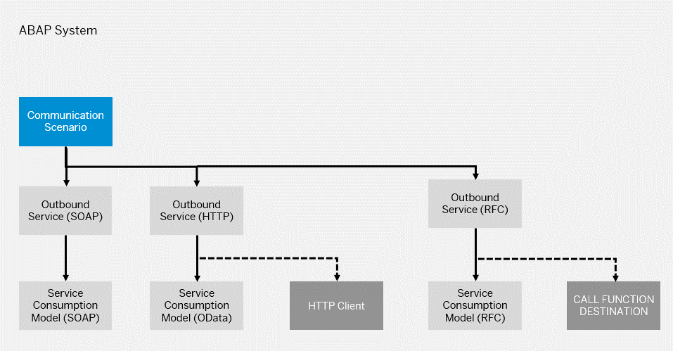

<!-- loiof871712b816943b0ab5e04b60799e518 -->

# Developing External Service Consumption \(Outbound Communication\)

Get more information about consuming external services.

To establish outbound communication between two communication partners, you have to implement the call of a service by doing the following:

-   Create an outbound service

    These outbound services can be HTTP \(see [Enable HTTP Communication in Your ABAP Code](enable-http-communication-in-your-abap-code-cef1ada.md)\), RFC \(see [Enable RFC Communication in Your ABAP Code](enable-rfc-communication-in-your-abap-code-bbbd142.md)\), or SOAP services \(see [Enable SOAP Communication in Your ABAP Code](enable-soap-communication-in-your-abap-code-6ab460e.md)\).

-   Create a communication scenario and assign it to the outbound service

    If you enable multiple arrangements, you can add customer-specific properties to the scenario to enable a simple receiver determination.

-   Implement the call of the service by using the `create_by_comm_arrangement` method for outbound communication depending on the service protocol, e.g. for HTTP service:

    > ### Sample Code:  
    > ```
    > DATA(lo_destination) = cl_http_destination_provider=>create_by_comm_arrangement(
    > 	comm_scenario        = '<SCENARIO ID>'
    > 	service_id           = '<OUTBOUND SERVICE ID>'
    > 	comm_system_id       = system_id ).
    >  
    > DATA(lo_http_client) = cl_web_http_client_manager=>create_by_http_destination( lo_dest ).
    > ```

    If the scenario includes multiple communication arrangements, you have to determine the communication system. You can read the customer-specific properties using class `CL_COM_ARRANGEMENT_FACTORY` to determine the receiver communication system.


  

> ### Note:  
> Alternatively, if you only want to call a remote Web service, use the following method
> 
> ```
> DATA(lv_dest) = cl_http_destination_provider=>create_by_url( i_url = 'https://www.example.com' ).
> ```
> 
> Use the URL approach mainly for testing purposes.

> ### Recommendation:  
> We recommend using the `create_by_comm_arrangement` method for outbound communication.


<a name="loiof871712b816943b0ab5e04b60799e518__section_m3y_rh4_y5b"/>

## Service Consumption Model

SAP supports various protocols and provides the corresponding clients and functions to handle requests and responses.

HTTP: `CL_WEB_HTTP_CLIENT`

RFC: `CALL FUNCTION`

To simplify the implementation of a remote call, you can create a service consumption model for the external service. The service consumption model creates proxies for the remote service. That way, you can access the service in a strictly typed manner without the need to compile requests and parse responses. The following consumption model types are supported:

-   OData
-   SOAP
-   RFC

**Related Information**  


[Service Consumption via Communication Arrangements](service-consumption-via-communication-arrangements-86aece6.md "")

