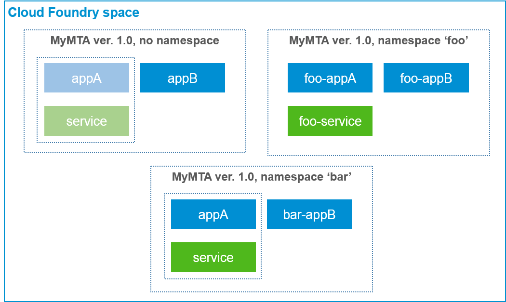

<!-- loiob28fd77836d44bde8c404618bf0f1228 -->

# \(Experimental\) Namespaces

Use this feature to prevent conflicts for applications deriving from the same MTA, but with different version, features, and configuration.

> ### Restriction:  
> -   This feature is experimental. We advise you first try it out in a non-productive environment.
> -   The namespace can only be passed as an argument to the deployment call, and cannot be modelled directly in the descriptor.


<a name="loiob28fd77836d44bde8c404618bf0f1228__section_myh_r5w_qmb"/>

## Prerequisites

-   Make sure the version of your MultiApps Plug-in is 2.5.0 or higher. If required, use the procedure described in [Install the MultiApps CLI Plugin in the Cloud Foundry Environment](../50-administration-and-ops/install-the-multiapps-cli-plugin-in-the-cloud-foundry-environment-27f3af3.md) to update it.


<a name="loiob28fd77836d44bde8c404618bf0f1228__section_env_jvw_qmb"/>

## Feature Description

By using the namespaces feature, you can deploy and operate a single multitarget applicaton multiple times within a single space. This is useful when you have to avoid conflicts among applications or entities. It modifies the modules and resources by adding a namespace at the beginning of the application names, service names, and routes.

The feature is employed by adding the parameter ***\--namespace***, when you input the deployment command in the Cloud Foundry Command Line Interface \(CF CLI\), and by modifying the deployment descriptor as described below. Using a more detailed configuration, you can include of exclude specific resources from having the namespace feature applied to them, namely:

-   services
-   modules
-   routes.

When set so, the excluded resources are shared among all namespaces of this MTA archive.


<a name="loiob28fd77836d44bde8c404618bf0f1228__section_nln_mdd_4nb"/>

## Procedure

To deploy several entities of a multitarget application using namespaces, proceed as follows:

1.  \(Optional\) Descriptor modifications are not required, but you can consider to employ one or both the following options:
    1.  You can specify to which route the `apply-namespace` prefix should not be applied:

        > ### Sample Code:  
        > ```
        > modules: 
        >   - name: appA
        >     type: java.tomee
        >     path: application.war
        >     parameters: 
        >       routes: 
        >         - route: application.${default-domain}
        >         - route: route-without-namespace.${default-domain}
        >           apply-namespace: false
        > ```

    2.  You can set `apply-namespace` to not be applied on the module, but to be applied to a specified route:

        > ### Sample Code:  
        > ```
        > modules: 
        >   - name: appA
        >     type: java.tomee
        >     path: application.war
        >     parameters: 
        >       routes: 
        >         - route: application.${default-domain}
        >         - route: route-with-namespace.${default-domain}
        >           apply-namespace: true
        >     apply-namespace: false
        > ```


2.  Using the CF CLI, deploy the initial MTA archive by using the following command:

    ***$ cf deploy ./MyMTA.mtar***

3.  \(Optional\) Check the deployment by inspecting the applications and details. Use the commands:

    ***$ cf a***

    ***$ cf mtas***

    ***$ cf mta MyMTA***

4.  For each subsequent deployment of the same MTA archive, use the following command:

    ***$ cf deploy ./MyMTA.mtar --namespace <your namespace\>***

5.  \(Optional\) Check whether your subsequent deployments have not removed the original MTA deployment:

    ***$ cf a***

    ***$ cf mtas***

    ***$ cf mta MyMTA --namespace <your namespace\>***

6.  Validate your deployments by calling their exposed web endpoints:

    ***$ cf a | grep '^appA'***

    ***$ cf a | grep '^<your namespace\>-appA'***

    1.  when using a route without a namespace ***curl https://route-without-namespace.<domain\>***
    2.  when using a route with a namespace ***curl https://<your namespace\>-route-with-namespace.<domain\>***


You might have one of the following results, depending on your usage

-     

    -   This image shows an MTA deployed in the same space - once without namespace \(default behaviour\), and once with namespace `foo`. The second deployment creates applications `foo-appA` and `foo-appB` from modules `appA` and `appB` and service instance `foo-service` from resource `service`
    -   If `appA` is bound to `appA.my-domain.com`, then `foo-appA` is automatically bound to `foo-appA.my-domain.com` upon deployment
    -   If `appA` requires service instance `service` then `foo-appA` is bound to a different service instance called `foo-service`.

-   

    In the above image, the third MTA is deployed in namespace `bar`, but with `appA` and `service` having the `apply-namespace: false` parameter. This causes the MTAs to share them, and the application and service are not recreated. However, their metadata is updated, so they are only detected as part of the latest deployed MTA.


<a name="loiob28fd77836d44bde8c404618bf0f1228__section_x22_m3d_4nb"/>

## Special use: sharing one resource among several MTAs using namespaces

You can use deployment with namespaces in a way that only one of the resources receives a namespace. To do so, you use the parameter `apply-namespace` in the MTA deployment descriptor follows, and then deploy by using the procedure above. The deployment result should be as follows:

For the example below we use a service, but this specual use can be applied to any module or resource in the descriptor.

> ### Sample Code:  
> ```
> ...
>   - name: serviceA
>     type: auditlog
>     parameters:
>       apply-namespace: false 
> ...
> ```

In the snippet above, the `apply-namespace: false` overrides the default value `true`, thus prohibiting the creation of additional instances of the service. This means that the service is unique in the space across all deployments of the MTA, and shared among them.

To see practical example of the implementation above, go to [Deploying MTA in a Namespace](https://github.com/SAP-samples/cf-mta-examples/tree/master/namespace).

