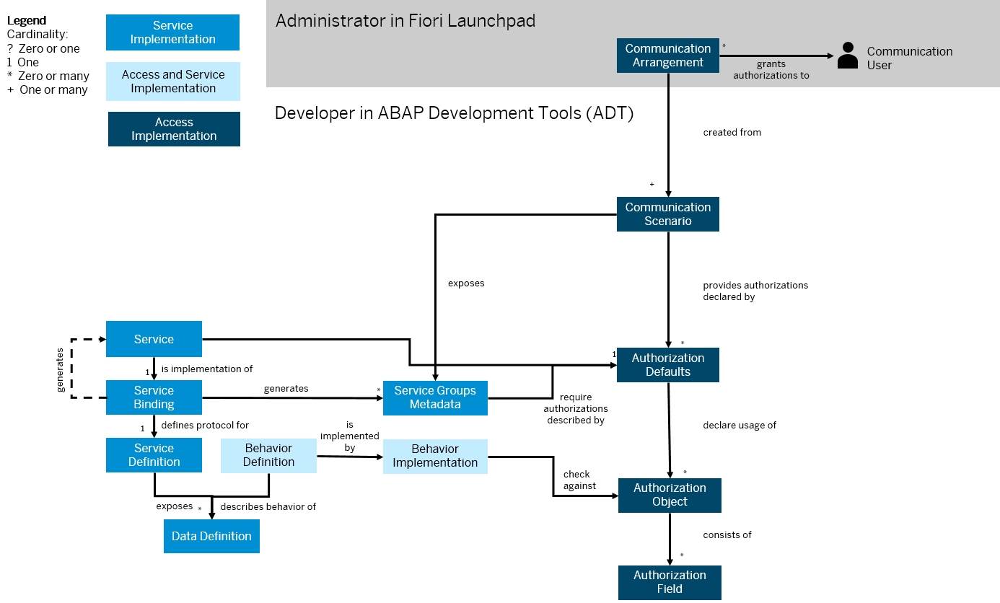

<!-- loiobc9c2c927d47402e9bbdfba30e491046 -->

# Granting Access Based on Activities for Communication Users

In this scenario, you grant access depending on what the communication user should be allowed to do, for example, read or write access.

This scenario is more complex than a simple unrestricted access grant because you also need to create an authorization object and implement authority checks in the behavior implementation.

In this documentation, you get a more detailed overview of how to implement a separate read and write access. You can achieve such a separation by creating an authorization object with the standard authorization field for activities, an authority check to protect the service, and a communication scenario with authorization fields and activities defined. The administrator can then create two communication arrangements for read and write access each, for example.

