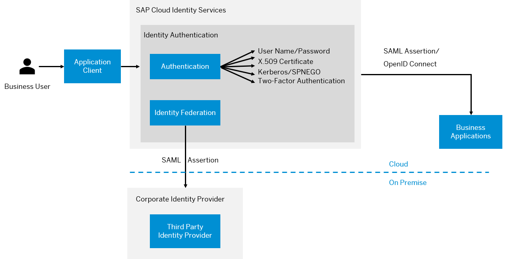

<!-- loio783103882c604a06b244ece500e59857 -->

# Identity Management

Identity management comprises setting up trust and providing credentials for business users.

In the ABAP environment, the default identity provider for applications is Identity Authentication service or rather SAP ID service, an instance of Identity Authentication service. It is used to set up trust for business users and supports identity federation, which enables user access across various systems by exchanging identity information based on a trust relationship. See [Identity Federation](identity-federation-2abdc1d.md).

Using the default identity provider, you can also establish trust to a custom identity authentication service tenant. See [Setup of a Custom Identity Service \(Optional\)](../20-getting-started/setup-of-a-custom-identity-service-optional-550251a.md).

Additionally, you have the option to use a corporate identity provider. In this case, we recommend using the Identity Authentication service as a proxy for the corporate identity provider. See [Corporate Identity Providers](https://help.sap.com/viewer/6d6d63354d1242d185ab4830fc04feb1/Cloud/en-US/19f3eca47db643b6aad448b5dc1075ad.html). Note that there is no direct trust relationship between the authenticating identity provider and the service provider that the business user is trying to access. For this scenario, in a hybrid landscape, we recommend the following identity and access management architecture:

**Related Information**  

[Trust and Federation with Identity Providers](https://help.sap.com/viewer/65de2977205c403bbc107264b8eccf4b/Cloud/en-US/cb1bc8f1bd5c482e891063960d7acd78.html)

[SAP Cloud Identity Services - Identity Authentication](https://help.sap.com/viewer/product/IDENTITY_AUTHENTICATION/Cloud/en-US)

