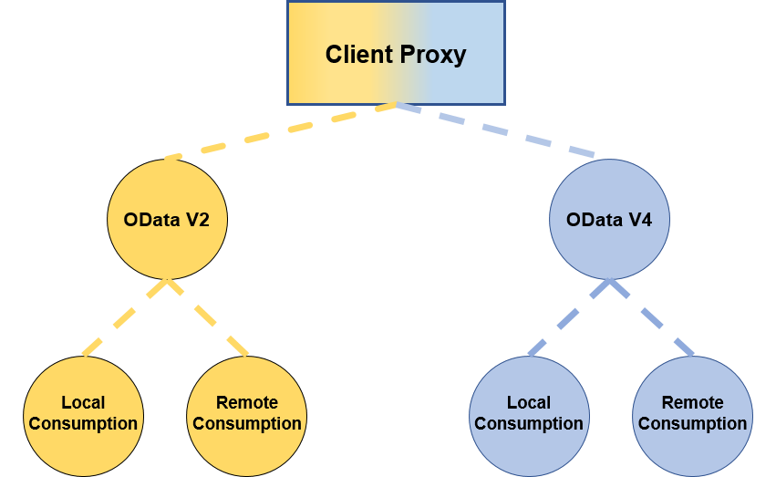

<!-- loio0d92f493624f47fba997d3a5e0dd2a0d -->

# OData Client Proxy - Introduction

The **OData Client Proxy** is the interface between the client \(consumer of a service\) and the service implementation \(data provisioning\) in the context of OData service consumption via ABAP. It allows the ABAP developer to develop OData client coding so that OData requests can be executed programmatically within your ABAP coding, for example, to directly execute an OData request from within your ABAP coding.

The **OData Client Proxy** is available in different configurations, depending on the current use case:

-   Consumption Type

    -   Local Client Proxy

        Use this Client Proxy for the consumption of an OData service on the current server without HTTP.

        -   No HTTP overhead

        -   The OData service is processed in the same application session. This allows integration testing, for example, including stubbing.

    -   Remote Client Proxy

        Use this Client Proxy for the consumption of an OData service that is offered on a remote server.

-   OData Version

    -   OData V2 Client Proxy

        Use this Client Proxy for the consumption of an OData V2 service.

    -   OData V4 Client Proxy

        Use this Client Proxy for the consumption of OData V4 services.

> ### Note:  
> The above mentioned configurations \(for example, the OData version and the consumption type\) depend on each other. There is, for example, a local OData V2 Client Proxy or a remote OData V4 Client Proxy, but not a local Client Proxy independent of the OData version. Exception: the asynchronous Client Proxy is only available for remote consumption of OData V4 services.

  

> ### Restriction:  
> For known constraints of the Client Proxy, refer to SAP note [2428114 - SAP Gateway Foundation SAP\_GWFND OData Client Proxy - Known Constraints](https://launchpad.support.sap.com/#/notes/2428114).

