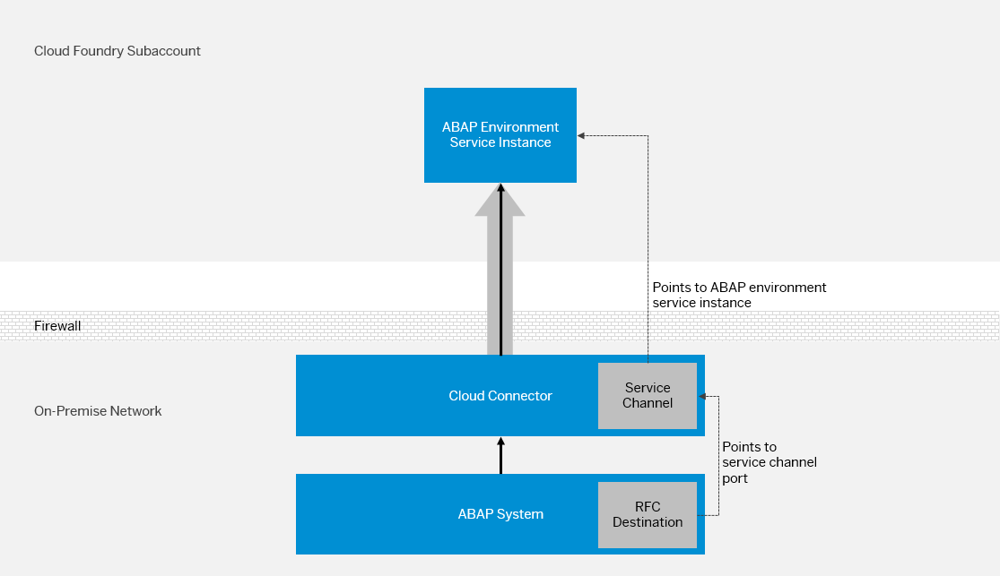

<!-- loio2ec368e9166c429fbc8970ebb5a8ba63 -->

# Set Up the Cloud Connector for Inbound RFC from On-Premise Systems

Configure inbound connectivity to the ABAP environment to consume a remote-enabled function module \(RFM\) from an on-premise ABAP system through the Cloud Connector.

<a name="loio2ec368e9166c429fbc8970ebb5a8ba63__section_oyf_yvw_smb"/>

## Context

RFC connections from on-premise systems to the ABAP environment can be performed through a so called Cloud Connector *service channel*.

> ### Note:  
> You can use WebSocket RFC instead. HTTP\(S\) or WebSocket RFC connections do not require the Cloud Connector because they can be opened directly on the Internet.

To establish an RFC connection from an on-premise system to the ABAP environment, the Cloud Connector opens an RFC port just like an RFC gateway and acts as a local proxy for the cloud system. Connections to this port are routed through a secure tunnel to SAP BTP.

  

In the Cloud Connector, you create a service channel with a local instance number. In the on-premise ABAP system, you correspondingly create an RFC destination in transaction SM59 with the hostname of the Cloud Connector in your on-premise network and the same instance number.

> ### Note:  
> If you are using different ABAP instances on SAP BTP, create a service channel for each instance, choose an arbitrary instance number in the service channel settings of the Cloud Connector configuration, and use the same instance number in the RFC destination of your on-premise system \(transaction SM59\) to identify the called ABAP instance. Since the instance number is defined as a two-digit number, the number of target systems you can configure in the Cloud Connector is limited to 99.

<a name="loio2ec368e9166c429fbc8970ebb5a8ba63__section_jmx_prc_cnb"/>

## Prerequisites

-   You have developed a communication scenario that contains the RFM to be called.
-   You have created a communication arrangement of that scenario with a communication system and communication user.

    > ### Note:  
    > To define authorizations for the communication user, use the authorization default values on inbound service level. These authorizations are automatically assigned to the respective communication user.

<a name="loio2ec368e9166c429fbc8970ebb5a8ba63__section_fjv_qrc_cnb"/>

## Restrictions

-   Only remote function modules that are part of a communication scenario can be called from an on-premise system. Most others are blocked, except for the system function module RFCPING.
-   An inbound RFC connection supports only *basic authentication* as authentication type.
-   The user used for authentication must be a *communication* user, a *business* user is not allowed.
-   The user name you can enter in an RFC destination of an on-premise ABAP system is limited to 12 characters.

<a name="loio2ec368e9166c429fbc8970ebb5a8ba63__section_w34_zvw_smb"/>

## Procedure

1.  To establish a service channel, configure it in the Cloud Connector as described in [Configure a Service Channel for RFC](https://help.sap.com/viewer/b865ed651e414196b39f8922db2122c7/Cloud/en-US/18602c25ae33423f847e9f2c539d7fa0.html).

    > ### Note:  
    > When creating a service channel for the ABAP environment, the URL of the ABAP instance \(tenant host\) follows the pattern *<myTenantHost\>.abap.hana.ondemand.com* \(not *<myTenantHost\>**\-api***..., which is valid only for connections to S/4HANA Cloud\). Make sure you create the service channel for the correct subaccount.

2.  Create an RFC destination in the on-premise system:

    -   Use connection type 3 \(RFC connection to an ABAP system\).

    -   **Do not use load balancing**. As target host, enter the hostname of Cloud Connector. As instance number, enter the local instance number you have used in the configuration of the service channel in the Cloud Connector.
    -   Provide logon credentials for a *communication* user.
    -   Use the connection test in transaction SM59 to verify that the service channel works correctly.

    > ### Note:  
    > When calling an RFM, you must write its name in *upper case*.

