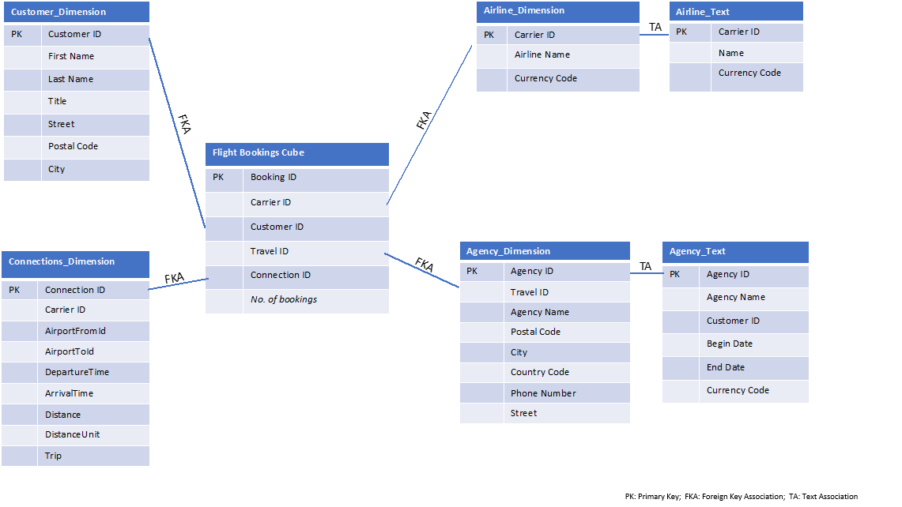

<!-- loio483cc0637280445b98e98775dd0383b1 -->

# Star Schema

The structure of the analytical model resembles a star \(see graphic below\): The cube or fact view at its center is surrounded by and connected to various dimension views. That's why it is also referred to as a star schema.

<a name="loio483cc0637280445b98e98775dd0383b1__section_wnv_msv_3pb"/>

## The Star Schema

Analytical models are built on top of CDS views/CDS view entities. Certain CDS views can take over the role of fact views, cube views \(= cubes\), dimension views \(= dimensions\) or text views in an analytical model. These different types of views are defined by the following annotations:

-   Fact views: `@Analytics.dataCategory: #FACT`

    A fact view contains facts that are suitable for extraction.

-   Cube views: `@Analytics.dataCategory: #CUBE`

    The cube view is the analytical interface view that is also used in the respective queries and holds the model together. It selects from facts and can be enriched with additional fields.

-   Dimension views: `@Analytics.dataCategory: #DIMENSION`

    The dimension view makes further attributes accessible.

-   Text views: `@objectModel.dataCategory: #TEXT`

    Text views bring language-dependent texts into the model.

-   Hierarchy views: `@objectModel.dataCategory: #HIERARCHY`

    Hierarchy views map hierarchical structures such as region, country, state, county, city. The can also be recursive \(e.g. employee - manager\). We will not be using hierarchy views in our example.

> ### Note:  
> For more information on CDS views and CDS view entities, see [CDS Views](https://help.sap.com/viewer/f859579898c7494dbe2449bb7f278dcc/Cloud/en-US/7c078765ec6d4e6b88b71bdaf8a2bd9f.html).

At the center of a star schema lies a **fact** view \(annotation `@Analytics.dataCategory: #FACT`\) or a **cube** view \(annotation `@Analytics.dataCategory: #CUBE`\). In our example, we will use a cube view. It will serve as the central data source in our analysis.

The cube view contains dimensional data \(= descriptive data such a carrier ID or a booking date\) as well as measurable data \(=quantifiable fields that can be calculated, e.g. the number of flight bookings\). We refer to these as **dimension fields** and **measures**.

Measures can be aggregated and, if necessary, can have an association to a unit of measure or a currency. Their aggregation behavior is defined via annotation `@Aggregation.default`. If annotation `@Aggregation.default: #SUM` is used, for instance, the measures will be summed in an analysis. If, for instance, a measure refers to a unit like ‘sales’, the annotations `@Semantics.currencyCode` or `@Semantics.unitOfMeasure` can be used to reference a currency code or a unit of measure. For more information on annotations that can be used in measures, see [CDS Annotations](https://help.sap.com/viewer/923180ddb98240829d935862025004d6/Cloud/en-US/130e02a697e14bf8b05dd6672c56250b.html).

Dimension fields can be used to filter the results of an analysis and to group the result rows of an analysis according to the values of the dimension fields. The more dimension fields a cube contains, the higher the flexibility of possible analyses as there are more options for filtering and grouping the data. Dimension fields in a cube view or a dimension view can also have an association to a text view. **Text**views \(annotation `@objectModel.dataCategory: #TEXT`\) provide language-dependent texts for the dimension fields. They are connected to the dimension fields via text association \(annotation `@ObjectModel.text.association`\).

Aside from dimension fields and measures, cubes may also contain numeric fields that aren't measures, and other special fields.

The cube view at the center of our star schema references **dimension** views \(annotation `@Analytics.dataCategory: #DIMENSION`\) which provide additional attributes for the dimension fields in the cube view: These dimension fields of the cube are connected to the dimension views via foreign key association \(annotation `@ObjectModel.foreignKey.association`\). They reference the field which was defined as representative key in a dimension view.

> ### Note:  
> The representative key is the most specific element of a primary key that represents the entity which the view is based on. In non-text views, it's used as an anchor of sorts when defining foreign key relationships. The representative key is defined via annotation `@ObjectModel.represenativeKey`.

For more information on the annotations needed for analytical data modelling, see [CDS Annotations](https://help.sap.com/viewer/923180ddb98240829d935862025004d6/Cloud/en-US/130e02a697e14bf8b05dd6672c56250b.html).

> ### Note:  
> **Fact Views and Cube Views**
> 
> Although possible, it isn't mandatory to construct a fact view to consume it from inside of a cube. You can expose the table that holds the measures directly in the cube to avoid an extra view and consequently an unnecessary level. Unlike cube views, fact views should not have joins or fields from dimension views, and they must hold only measurable values. If you want to connect your dimensions in the same view, you should therefore use a cube instead of a fact view. The facts and dimensions should be modelled with a normalized representation.

### Flight Booking Model:

In this guide, you will learn how to implement a simple analytical model that lets you analyze flight bookings based on the /DMO/Flight test database tables. We will create a data model containing measures and dimensions.

Measures

-   the total number of bookings

-   the price of each booking

Dimensions:

-   Airline
-   Connection
-   Customer
-   Agency

> ### Note:  
> Note that we will not be associating any text views in our example.

**Related Information**  

[Analytical Query](analytical-query-d3f8dc9.md "")

