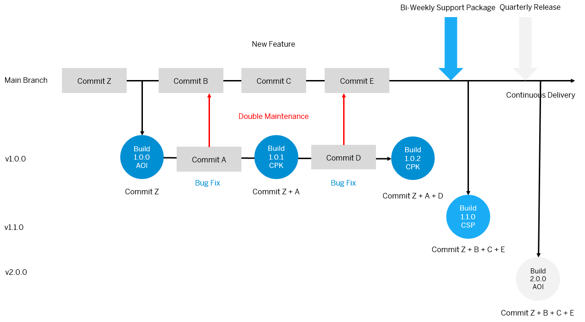
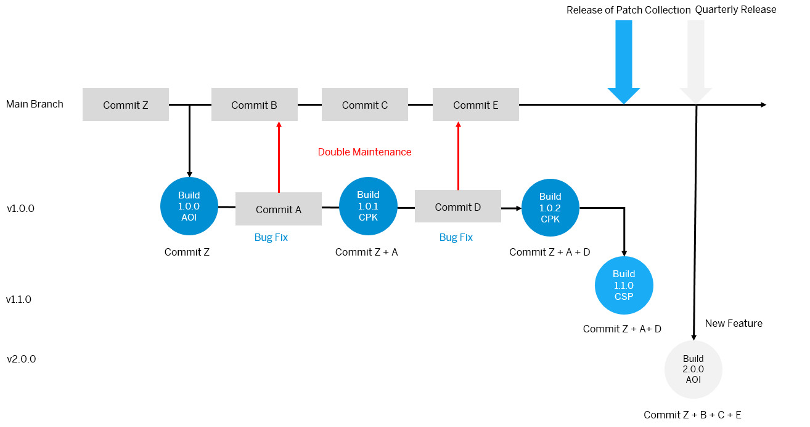
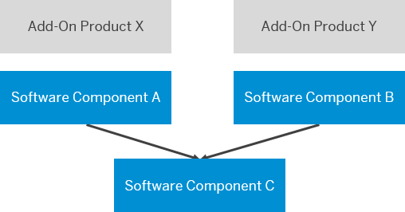
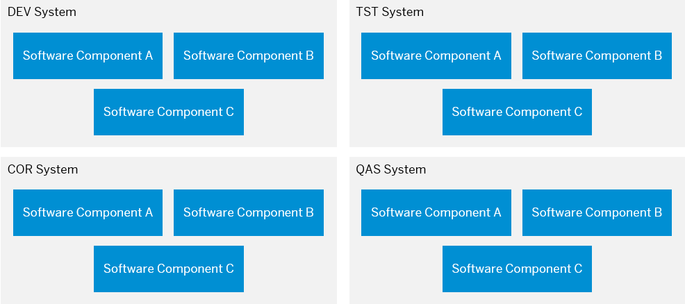

<!-- loio8c087bca40584f9b899282b4ec515753 -->

# Versioning and Branches

 <a name="loio882c222035734ff39ffaf36f463a4cda"/>

<!-- loio882c222035734ff39ffaf36f463a4cda -->

## Add-On Versioning


For the add-on delivery process, certain versioning principles apply. Learn how software components are combined to an add-on product and what versioning rules are used for both parts. Software components and add-on products follow a similar versioning pattern.


### Add-on Product Version

Instead of importing software components into productive systems, when providing a SaaS solution in the ABAP environment, software components are packaged and installed into ABAP systems based on so-called add-on products/software products.

You can only install one add-on product for each system using the ABAP environment `saas_oem` service plan instead of the `standard` service. During provisioning of this service, parameters `addon_product_name` and `addon_product_version` are used to install a certain add-on product version into the system, after the system has been provisioned. See [Define Your ABAP Solution](define-your-abap-solution-1697387.md).

The add-on product name includes a reserved development namespace to separate the name from other customers/partners. See SAP note [84282](https://launchpad.support.sap.com/#/notes/84282).

The versioning pattern `<Release>.<Support Package Stack Level>.<Patch Level>` applies to the add-on product version.

> ### Note:  
> Only in a new release, you can change the bundled software components of the add-on product.

Technically, the allowed number range is 1.0.0 to 9999.9999.9999.

For the release, there are no technical restrictions regarding the number of new versions. You only have to consider that the version has to be ascending across builds and there must be no gaps between versions. The initial release is always 1.0.0.

The support package stack level count starts again from 0 with each release.

The patch level count starts again from 0 with each support package.

While providing a specific add-on version, leading zeroes should be omitted \(1.2.3 instead of 0001.0002.0003\).

The add-on product version should be increased analogous to the version of the leading software component. The leading software component is the software component that is, as opposed to a reuse software component, exclusively used as part of one add-on product.

An exception to this recommendation is the patch level in the add-on production version: In case of an add-on product with a reuse software component, the patch level of the add-on product version might be higher than the patch level of the leading software component version.

For more information about software product versioning, see [Add-On Product Version](https://www.project-piper.io/scenarios/abapEnvironmentAddons/#add-on-product-version).


### Software Component Version

Software components are self-contained and include development packages as well as development objects. They are used in combination with a reserved development namespace to separate the name from other customers/partners. See [Software Components](software-components-58480f4.md).

The versioning pattern `<Release>.<Support Package Level>.<Patch Level>` also applies to the software component version.

> ### Note:  
> Software component versions are delivered with delivery packages. However, software component versions are not individual shipment entities. They can only be delivered to customers as part of a software product version.
> 
> Software component versions are only built once, independent from add-on product versions where the software component version was referenced. If an add-on product version is referring to a software component version that has already been created as part of a different add-on build, the created delivery package is reused.

Technically, the allowed number range is 1.0.0 to 9999.9999.9999.

For the release, there are no technical restrictions regarding the number of new versions. You only have to consider that the release has to be ascending across builds and there must be no gaps between versions. The initial release is always 1.0.0.

The support package level can only go up until 369 because of technical limitations. The support package level count starts again from 0 with each new release.

For the patch level, there is a technical limit of 36³, limited to 9999. The patch level count starts again from 0 with each support package.

For more information on software component versioning, see [Software Component Version](https://www.project-piper.io/scenarios/abapEnvironmentAddons/#software-component-version).

 <a name="loio398be26971414fbb91cbe3b0a3cb8a26"/>

<!-- loio398be26971414fbb91cbe3b0a3cb8a26 -->

## Add-On Package Types


For the delivery of add-ons, there are three package types that serve different purposes: AOI, CSP, and CPK.

Depending on the purpose, the development objects to be included in the object list of the package are calculated differently based on the state of the software component.

> ### Note:  
> The required type of delivery is automatically determined by the delivery production tools based on how the version number of software components is changed.


### AOI \(Add-On Installation\)

Changes to the release of a software component are delivered as add-on installation packages.

The add-on installation package is used for the initial release of software components. It is used to deliver new and enhancements of existing functionalities. Each AOI package contains all the objects of the software component. That means, every object is included in the object list of the package.


### CSP \(Component Support Package\)

Changes to the support package level of a software component are delivered as component support package.

The CSP is an ABAP support package used for major fixes of a software component version. These major fixes can be a larger collection of corrections but can also contain smaller functional enhancements. Whenever a CSP containing new objects such as bug fixes and/or new features is built, these objects are delivered in any subsequent AOI package.

CSP packages are built with a delta process dependent on the previous state of the software component used for the build. That means, only the changes made since the last change of the support package level or release are included to the object list of the CSP.


### CPK \(Correction Package\)

Changes to the patch level of a software component are delivered as a correction package.

The ABAP correction package is used for minor fixes and should only contain small corrections. Whenever a CPK is built, these objects are delivered in the first component support package \(CSP\) to follow and any subsequent AOI package. That way, new installations are up to date without the need to install patches.

CPK packages are built with a delta process dependent on the previous state of the software component used for the build. That means, only the changes made since the last change of the patch level are included in the object list of the CPK.

For more information on the add-on package types and how these are determined based on changes to the software component version, see [Software Component Version](https://sap.github.io/jenkins-library/scenarios/abapEnvironmentAddons/#software-component-version).

 <a name="loioea47e09911c24f658e5f111d21729ffd"/>

<!-- loioea47e09911c24f658e5f111d21729ffd -->

## Branching


> ### Note:  
> Keep in mind that there are some restrictions for using branches in your development processes, for example the merging of branches is not supported and has to be done manually. See [ABAP Environment Specifics](abap-environment-specifics-1367346.md).

Development in the ABAP environment is done in software components. For each software component, different branches can be created that include a different list of commits. For each system, only one branch can be active at a time. Branches are used to separate changes from each other that shall or might not be delivered together \(development vs. correction\).

To separate development of new features from the development of bug fixes for the active version of a software component, you can use branches for different purposes:

-   **Main Branch**: Implementation of new planned features that are to be delivered in the future \(development codeline\)
-   **Maintenance Branch**: Implementation of unplanned bug fixes for the active version of a software component that is deployed to customer systems \(maintenance codeline\)


The main branch is the default branch of each software component and therefore already exists when the software component is created. This branch is not deleted throughout delivery of different software component versions.

A maintenance branch is created for each support package level of a software component and should be named accordingly, for example v1.1.0 for support package level 1 in release 1. Maintenance branches can be deleted once the successor support package level is the currently deployed support package level in customer systems.

> ### Recommendation:  
> Create a new maintenance branch with each new support package level, and thus with each new AOI and CSP package delivered for a software component.

For the first release, the main branch of software components is used to create a maintenance branch for the add-on build process. In subsequent versions, the development and correction code line are separated by using the main branch and the maintenance branch. See [Use Case 2: One Development and Correction Codeline in a 5-ABAP-System Landscape](use-case-2-one-development-and-correction-codeline-in-a-5-abap-system-landscape-4e53874.md).

All corrections to a software component based on a certain support package level are released in the corresponding maintenance branch and need to be maintained as new commits in the main branch \(double maintenance\). See [Double Maintenance of Corrections into Development](double-maintenance-of-corrections-into-development-1241b14.md).

For each ABAP system, only one branch can be active at a time. Therefore, in development system DEV and test system TST, the main branch of a software component is checked out. Whereas in correction system COR and quality assurance system QAS, the currently relevant maintenance branch is checked out.

 <a name="loio326508756a144c49b98e5fcf442cce40"/>

<!-- loio326508756a144c49b98e5fcf442cce40 -->

## Delivery Models


Based on the mentioned software component versioning principles, the add-on package types, and branching approach, you can use different delivery models.

> ### Recommendation:  
> You should choose the delivery model based on the existing processes in your development/shipment environment. Shorter delivery cycles have the advantage that new features are delivered more frequently. Therefore, we recommend following the continuous delivery approach whenever possible.


### Continuous Delivery

With the continuous delivery approach, new features should be delivered as soon as possible: In this case, new features can be shipped with support packages more often than new releases of a software component. These short development cycles ensure that changes can be deployed on short notice and in smaller increments. See [Continuous Integration and Delivery \(CI/CD\)](https://help.sap.com/viewer/65de2977205c403bbc107264b8eccf4b/Cloud/en-US/fe74df55b0f54e99bf6e13a3b53e1db0.html).



In this example, commit Z represents all the commits prior to the first build.

The maintenance branch v1.0.0 is used for bug fixes that must be manually maintained in the main branch, which requires double maintenance to make sure that the development code line is up to date.

Commit Z and commit C are new features implemented in the development code line on the main branch. Development of these features is done in the DEV system, testing in the TST system.

Commit A and commit D are small corrections that are implemented in the correction code line on the maintenance branch for support package level zero of software component release one.

Development of these bug fixes is done in the COR system, testing in the QAS system.

After releasing these corrections in the maintenance branch, you have to maintain them as well in the main branch in the DEV system to secure consistency of changes in the correction and development code lines. As a result, commit B and E are created in the main branch to reflect the corrections made in the maintenance branch \(commit A and commit D\).

The new support package build for version 1.1.0 is derived from the main branch and includes new features and bug fixes since the last support package level 1.0.0 has been released. With the new support package build for version 1.1.0 of the software component, a new maintenance branch v1.1.0 is created. All corrections for this support package level are developed on this branch.

For a new release, add-on version 2.0.0 is released. The resulting AOI package includes all features and bug fixes since the last AOI build for version 1.0.0 has been released.

Branch v1.1.0, that is based on the main branch, includes same commits as the main branch \(Z, B, C, and E\). For the build of CPK v1.0.2 and CSP v1.1.0, however, only the objects that have been changed since the previous CSP/AOI are included in the object list.

> ### Note:  
> With this delivery model, support packages not only include the corrections for the current support package level but also new features allowing shorter development cycles.

> ### Recommendation:  
> In a continuous delivery model, we recommend:
> 
> -   Building and deploying a new CSP on a weekly or biweekly basis.
> -   Shipping new software component releases on a quarterly basis. These AOI packages contain every object that has been built and delivered with the support packages, including all the patches.
> 
> We recommend shipping new software component releases on a quarterly basis. These AOI packages contain every object that has been built and delivered with the support packages, including all the patches.
> 
> In a continuous delivery model, we recommend building and deploying a new CSP on a weekly or biweekly basis.


### Quarterly Shipment

The quarterly delivery approach is recommended whenever longer test cycles are necessary and faster incremental development is not feasible. This might be required due to industry requirements, legal requirement etc.



Compared to the continuous delivery model, the maintenance branches for each support package level are not created based on the main branch but on the previous maintenance branch: e.g. branch v1.1.0 is based on v1.0.0.

That way, support packages are only used for the purpose of patch collections: only the corrections in commit A and D that were already delivered as patches in version 1.0.1 and 1.0.2 are included in support package 1.1.0.

> ### Note:  
> With this delivery model, new features are only delivered with new release versions \(AOI packages\). The build for version 1.1.0 does not include commit C. As late as with the build for version 2.0.0, this feature is shipped. Consequently, new features take longer until they are available in production systems.

This delivery model is similar to processes commonly used to ship on-premise solutions where upgrades are much more complex and usually performed on a quarterly basis. Instead of shipping more often but in smaller packages, this approach promotes building larger shipment packages with a lot of new features.

Branch v1.1.0, that is based on branch v1.0.0, includes the same commits as branch v1.0.0 \(Z, A, and D\). For the build of CPK v1.0.2 and CSP v1.1.0, however, only the objects that have been changed since the previous CSP/AOI are included in the object list.

 <a name="loio919be04888aa4e07b1a99416fb8bb68d"/>

<!-- loio919be04888aa4e07b1a99416fb8bb68d -->

## Multiple Software Components


Add-On products can consist of multiple software components. However, objects of one software component can't be used in another software component by default. Software components provide their functionality to other software components via explicitly released APIs. This means, you must set the API state of an object to *Released* if you want to use it from another software component. See [Released APIs](https://help.sap.com/viewer/5371047f1273405bb46725a417f95433/Cloud/en-US/c479660d07374c15a1a5fe83fdbb1337.html) and [Finding Released APIs and Deprecated Objects](https://help.sap.com/viewer/5371047f1273405bb46725a417f95433/Cloud/en-US/3f232ac7cecc4d9891ff512462240223.html).

Having this in mind, you can structure development into reuse components that are used across several components.



In this example, one add-on product consists of software component A and software component C, whereas another add-on product consists of software component B and C. Software component A and B use released objects of software component C, and thereby depend on this software component.

Once you have released an object, we recommend not changing it incompatibly because this can lead to errors for its consumers.

Software components must not have cyclic dependencies. In the example above, software component C must not use objects from software component A. For more information on software component restrictions, see [Software Components](software-components-58480f4.md).

In the add-on descriptor, dependencies are reflected by the order of the components in the repositories list:

```
---
addonProduct: "/NAMESPC/PRODUCT_X"
addonVersion: "1.2.0"
repositories:
  - name: "/NAMESPC/COMPONENT_C"
    branch: "v1.2.0"
    version: "1.2.0" 
    commitID: "7d4516e9"
  - name: "/NAMESPC/COMPONENT_A"
    branch: "v2.0.0"
    version: "2.0.0" 
    commitID: "9f102ffb" 
    
```

In this case, component `/NAMESPC/COMPONENT_C` is the reuse component. It has no dependencies to any other top components and is therefore listed first. This is important for the right order during software component import. `/NAMESPC/COMPONENT_C` needs to be imported before `/NAMESPC/COMPONENT_A` to avoid import errors. In addition to that, software components in the bundle can use different namespaces in the software component name.

> ### Recommendation:  
> In a software component bundle with a reuse component, this component is assembled whenever the software component version is defined for the first time in the add-on descriptor file. Therefore, make sure to define the correct software component version to prevent building the wrong software component version for `/NAMESPC/COMPONENT_C`.
> 
> We recommend following the same delivery model \(identical shipment cycles\) for all involved software components in a delivery scenario with a reuse component.


In this scenario, add-on product X and Y are based on the continuous delivery model and still undergo development. That means, for both add-on products, a new version can be shipped on a bi-weekly basis.

Consequently, software components A and B refer to objects in the same branch of the reuse software component C, for example branch v1.2.0

Let’s assume that development and correction of both software components is performed in one DEV and COR system. If there has to be a bug fix in software component C, corrections to the corresponding software components A and B are still possible. This is due to the fact that branch v1.2.0 can remain checked out in software component C, while these changes are made.

The same applies to the develpoment process: A new feature can be developed in software component A using the main branch of software component C. Since only the main branch of software component C is used in the DEV system, the development in the corresponding software components A and B can continue in parrallel.

This scenario is resource-efficient: only one system is required for development in system DEV and one for corrections in COR. With respect to the developer experience, it is more convenient to have all implementation components in one development system because everything is in one place and the whole system landscape is easily understandable.



The system setup regarding the testing and quality assurance for corrections depends on how you want to test the add-on products:

-   Do you want to provide a test environment that is identical to a production system with the add-on product installed? Then you should establish one TST and one QAS system for each add-on product in the sense that only those software components used for each add-on product are imported into these systems.

-   Do you want to reduce the number of systems without restricting the test environment? Then you only need one TST and one QAS system, where all software components are imported.


The number of required systems for DEV, COR, TST, and QAS depends on the number of branches that are actively used in dev, test, and build processes. Whenever more than one branch is actively used, one ABAP system is required per branch because an ABAP system always checks out only one branch of a software component.

