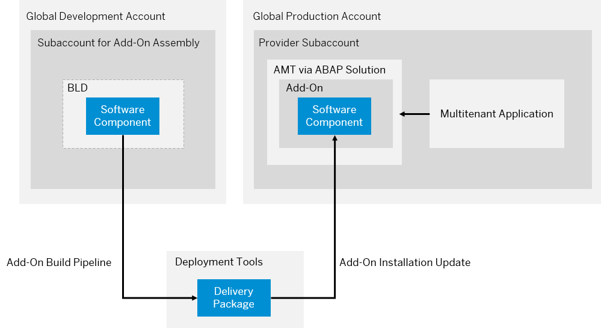
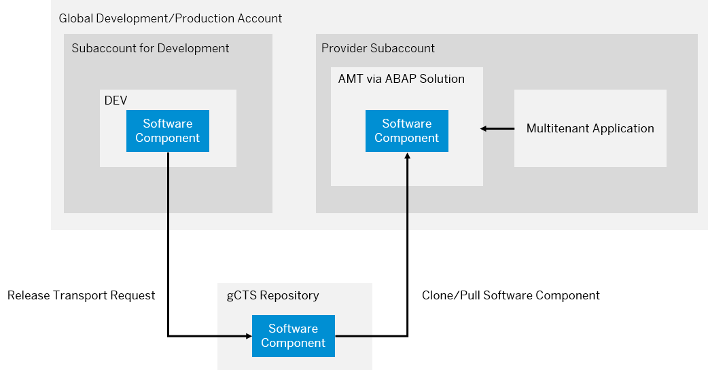

<!-- loio438d7ebfdc4a41de82dcdb156f01857e -->

# Delivery via Add-On or gCTS

For SaaS solutions in the ABAP environment, software components including ABAP development objects have to be delivered to the customer production system. This is referred to as upstream process.

Afterwards, the SaaS solution is provided by offering a multitenant application that facilitates a subscription mechanism. This is referred to as downstream process.

There are multiple options to deliver software components to the systems. The delivery process described in this documentation mainly focuses on using add-on products as a means to deliver software components by installing or updating delivery packages in a system. See [The Add-On Product](https://www.project-piper.io/scenarios/abapEnvironmentAddons/#the-add-on-product).

As an alternative, you can choose a delivery process using the gCTS-based import of software components. See [Transport Mechanisms](transport-mechanisms-aa7f169.md).

<table>
<tr>
<td valign="top">

 

</td>
<td valign="top">

**Add-On Build-Based Delivery**

</td>
<td valign="top">

**gCTS-Based Delivery**

</td>
</tr>
<tr>
<td valign="top">

**Versioning**

</td>
<td valign="top">

-   Add-ons induce explicit versioning on product and software component level
-   The add-on product version is visible in the system details in the Landscape Portal application. See [View Tenants and Systems](view-tenants-and-systems-99c975e.md).
-   Different version numbers correspond to different types of delivery packages on software component level
-   The way various package types are imported into the systems is different

</td>
<td valign="top">

-   Explicit versioning is not integrated into the gCTS transport technology
-   No different import package types
-   When following this gCTS-based delivery approach, versioning needs to be managed and tracked manually. See [Use Case 2: One Development and Correction Codeline in a 5-ABAP-System Landscape](use-case-2-one-development-and-correction-codeline-in-a-5-abap-system-landscape-4e53874.md).

</td>
</tr>
<tr>
<td valign="top">

**Tool Support**

</td>
<td valign="top">

-   ABAP environment pipeline needs to be executed in a Jenkins CI/CD Server
-   Initial configuration effort and requires to setup Jenkins Server [Infrastructure](https://www.project-piper.io/infrastructure/overview/).
-   Resulting delivery packages are either installed as part of an add-on during system provisioning or updated centrally in the systems using the *Landscape Portal*application. See [Perform Add-on Updates](perform-add-on-updates-8c5cb9e.md).

</td>
<td valign="top">

-   Changes to software components are released and exported to a central remote repository using transport requests
-   The *Manage Software Components* app that is part of every ABAP system is used to trigger the import of new changes locally per system
-   As an alternative, software component import can be triggered by using the ABAP environment pipeline. See [ABAP Environment Pipeline](https://www.project-piper.io/pipelines/abapEnvironment/introduction/).

</td>
</tr>
<tr>
<td valign="top">

**ABAP Service Plan**

</td>
<td valign="top">

-   ABAP systems for development/testing purposes are of type `abap/standard` and provisioned in the global development account
-   ABAP systems including the installed add-on are of type `abap/saas_oem` and provisioned in the global production account

</td>
<td valign="top">

All ABAP systems are of type `abap/standard` and provisioned in the same global development account

</td>
</tr>
<tr>
<td valign="top">

**System Landscape/Account Model**

</td>
<td valign="top">

-   Global development account and global production account
-   Software components are made available across these different global accounts by using add-ons
-   For execution of the add-on build pipeline, an add-on assembly system BLD and add-on installation test system ATI are \(temporarily\) required

</td>
<td valign="top">

-   Single global development account because gCTS repositories are only shared among ABAP systems in the same region in the same global account
-   No additional ABAP systems are required to facilitate a build process

</td>
</tr>
<tr>
<td valign="top">

**Initial Deployment**

</td>
<td valign="top">

-   Add-ons are automatically installed during system provisioning of ABAP systems
-   Application content is available immediately in systems provisioned after subscription to the multitenant application

</td>
<td valign="top">

-   Application content is initially not available
-   Software components need to be cloned into the systems provisioned after subscription to the multitenant application using the *Manage Software Components* app locally. See [How to Clone Software Components](../50_administration_and_ops/how-to-clone-software-components-18564c5.md).

</td>
</tr>
<tr>
<td valign="top">

**Update Deployment**

</td>
<td valign="top">

Add-on update can be triggered centrally in a system using the *Landscape Portal* application. See [Perform Add-on Updates](perform-add-on-updates-8c5cb9e.md).

</td>
<td valign="top">

Latest changes can be pulled into a system by using the *Manage Software Components* app locally. See [How to Pull Software Components](../50_administration_and_ops/how-to-pull-software-components-90b9b9d.md).

</td>
</tr>
</table>

<a name="loio438d7ebfdc4a41de82dcdb156f01857e__section_uv2_jzr_2rb"/>

## Add-On-Based Delivery Process

An add-on is a bundle of software components. To create an add-on, a build process orchestrated by an add-on build pipeline has to be triggered.

With delivery tools, the software components are packaged into deliveries that are then further processed. Eventually, the deliveries are stored as delivery packages using the deployment tools provided by SAP.

Add-on deployment is either performed by using an add-on installation during system provisioning or as an add-on update triggered in the *Landscape Portal* application.

Delivery packages are of different types, which means that the build and deployment of these packages differ accordingly. For example, the import of a software component for an add-on installation package or delta-import for correction packages.

BLD and AMT systems are based on different service plans: `abap/standard` for a plain ABAP system and `abap/saas_oem` for an ABAP system with installed add-on. The usage of these service plans is separated in two different global accounts. Making software components available across different global accounts is only possible by using the add-on delivery process.

Once a first customer is using the SaaS solution, there is no migration path available to switch from add-on-based delivery to gCTS-based delivery.

<a name="loio438d7ebfdc4a41de82dcdb156f01857e__section_byp_kzr_2rb"/>

## gCTS-Based Delivery Process

The gCTS-based delivery process takes place in the global development account only. This is due to the fact that the underlying gCTS repository is only shared among systems in the same region in the same global account.

ABAP development objects are released with a transport request in a particular software component in the development system. The transport request release automatically exports the changes into an SAP-managed gCTS repository by creating a new commit. Once the changes are exported into the gCTS repository, they are centrally available and can be imported into any other systems in the same region in the same global account. By cloning a software component into a customer production system using the *Manage Software Components* app, implemented ABAP objects become available to customers subscribed to the multitenant application.

> ### Note:  
> The customer production system AMT of type `abap/standard` is provisioned during the initial subscription to the multitenant application. Since the SaaS solution needs to include the implemented software, software components have to be cloned right after the first subscription. As a SaaS solution operator, you can use a separate test subscription that is not related to a customer to trigger the creation of the system before the real customer subscribing to the solution. This initial system creation and import of the software components needs to be performed for each customer production system. If an ABAP solution is configured with `tenant_mode = single` \(see Define Your ABAP Solution\), a dedicated system is created per subscription. In that case, a gCTS-based delivery is only recommended if the SaaS solution is expecting a small set of customers or if the subscription is performed together with the customer.

