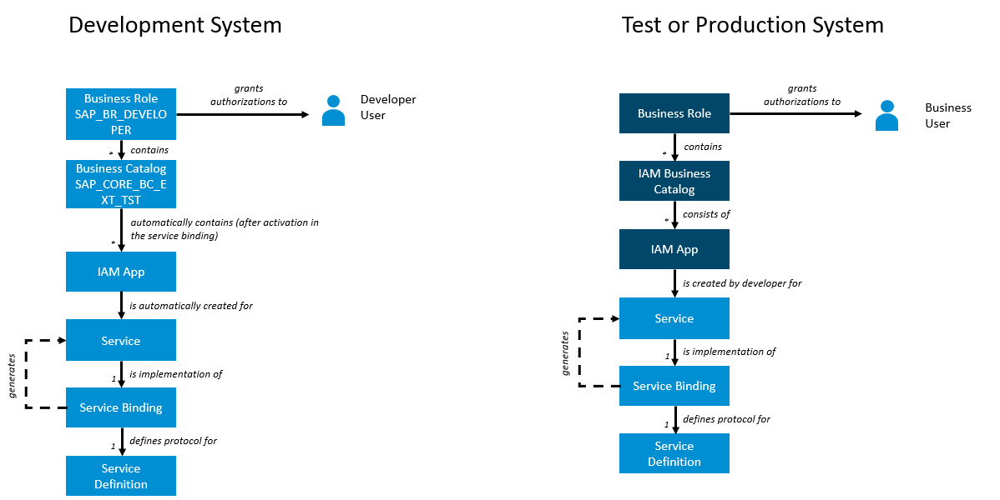

<!-- loio41f363976a5e44fcbcadd7bc2a1669de -->

# Providing \(Unrestricted\) Access for Business Users

In this scenario, you get information about how to provide unrestricted access with a few steps.

In this scenario, to provide access to the business service, you must create an IAM app and assign it to a business catalog. Administrators then create a business role that contains the business catalog and assigns the role to business users. Note that all objects that need to be created are highlighted in dark blue in the graphic.

This scenario requires only a few steps to provide authorizations, and it's the minimum that you must do to make your service available to business users. However, with this scenario, you always provide unrestricted write **and** read access. If you want to fine-tune the authorizations in more detail, check the scenarios *Providing Access Based on Activities* and *Providing Access Based on Field Values*.

**Related Information**  

[Providing Access Based on Activities for Business Users](providing-access-based-on-activities-for-business-users-f070f5d.md "In this scenario, you provide access depending on what the user should be allowed to do, for example, read or write access.")

[Providing Access Based on Field Values for Business Users](providing-access-based-on-field-values-for-business-users-d60c7fb.md "You can enable access to a service in such a way that it's dependent on the field values of a business object. As a result, business users can view or change only business object instances where the field values match their authorizations.")

