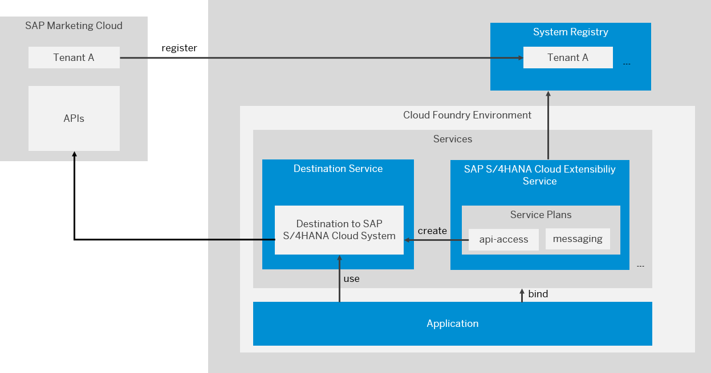

<!-- loio18bb3d945ab948b2ab2218b7869d0faf -->

# Extending SAP Marketing Cloud in the Cloud Foundry and Kyma Environment

<a name="loio18bb3d945ab948b2ab2218b7869d0faf__section_tf1_c2m_blb"/>

## Overview

> ### Note:  
> The SAP S/4HANA Cloud Extensibility service is availble for the EU-only access regions for feature set B global accounts. See [Regions](https://help.sap.com/docs/btp/sap-business-technology-platform/regions).
> 
> EU Access is not available for feature set A global accounts for the SAP S/4HANA Cloud Extensibility service.

SAP BTP offers a standard way for extending SAP solutions.

You can extend SAP Marketing Cloud in the Cloud Foundry or the Kyma environment without disrupting the performance and the core processes. When building extension applications, you can also benefit from the automation of the integration between the cloud platform and SAP Marketing Cloud.

> ### Note:  
> The content in this section is not relevant for China \(Shanghai\) and Government Cloud \(US\) regions.

The following graphic provides a high-level overview of the integration between the cloud platform SAP Marketing Cloud:

<a name="loio18bb3d945ab948b2ab2218b7869d0faf__section_z4j_xnm_blb"/>

## Process Flow

To integrate SAP BTP and SAP Marketing Cloud so that you can build extension applications, you have to use the SAP S/4HANA Cloud Extensibility service. All the steps are the same from the SAP BTP side. You register an SAP Marketing Cloud system in the SAP BTP cockpit. Then, you take the generated token and use it to configure the connectivity on the SAP Marketing Cloud side. These are the tasks you need to follow:

**Integrating SAP BTP and SAP Marketing Cloud**

<table>
<tr>
<th valign="top">

Process Step

</th>
<th valign="top">

Related Documentation

</th>
</tr>
<tr>
<td valign="top">

1. Connect the SAP Marketing Cloud system you want to extend with the corresponding global account in SAP BTP.

During the pairing process you create an registration token which is then used by the SAP Marketing Cloud system tenant administrator to configure the integration on the SAP Marketing Cloud system side.

</td>
<td valign="top">

[Register an SAP Marketing Cloud System in a Global Account in SAP BTP](register-an-sap-marketing-cloud-system-in-a-global-account-in-sap-btp-e9d975a.md)

> ### Note:  
> You cannot migrate the registered SAP Marketing Cloud systems between global accounts.
> 
> If you want to start using another global account, you will have to register your SAP Marketing Cloud systems again.

</td>
</tr>
<tr>
<td valign="top">

2. Make the SAP Marketing Cloud system accessible in the subaccounts in SAP BTP in which you want to build your extension applications.

To do so, you configure the entitlements and assign the corresponding quota and service plans to the subaccounts where the extension applications will reside for the system you registered in the previous step.

</td>
<td valign="top">

[Configure the Entitlements for the SAP S/4HANA Cloud Extensibility Service](configure-the-entitlements-for-the-sap-s-4hana-cloud-extensibility-service-65ad330.md) 

</td>
</tr>
<tr>
<td valign="top">

3. Configure the communication flow.

You have the following options:

-   Consume the SAP Marketing Cloud APIs \(inbound connection\) or consume APIs exposed by the extension application from SAP S/4 HANA Cloud \(outbound connection\)

    To do so, you create a service instance of the *SAP S/4HANA Cloud Extensibility* service using the *api-access* service plan.

    During the service instance creation an HTTP destination on a subaccount level is automatically generated in this subaccount. It contains all instance binding properties which are sufficient to establish connection to the SAP Marketing Cloud system. When creating the service instance, you configure the communication arrangement and the authentication type for the connection. The following authentication scenarios for SAP Marketing Cloud are supported:

    -   Basic Authentication \(inbound and outbound connections\)
    -   OAuth 2.0 SAML Bearer Assertion \(inbound connections\)
    -   OAuth 2.0 Client Credentials \(outbound Connections\)
    -   No Authentication \(outbound connections\)

    Both predefined and custom communication scenarios are supported.

-   Enable the consumption of SAP Marketing Cloud events.

    If you want to create event-based extensions for SAP Marketing Cloud using the SAP Enterprise Messaging service, you have to create a service instance of the *SAP S/4HANA Cloud Extensibility* service using the *messaging* service plan.

-   A combination of both

</td>
<td valign="top">

-   [Creating a Service Instance to Consume the SAP S/4HANA Cloud APIs](create-a-service-instance-to-consume-the-sap-s-4hana-cloud-apis-a735641.md)

-   [Enable the Consumption of SAP S/4HANA Cloud Events](enable-the-consumption-of-sap-s-4hana-cloud-events-d476ff0.md)

</td>
</tr>
</table>

