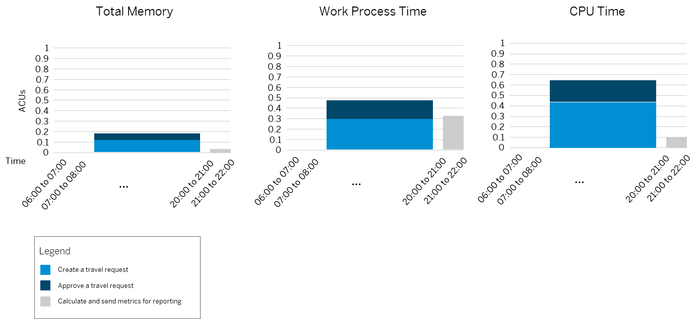

<!-- loioc9565cba5f5948d998f404a2b9ea1038 -->

# Combining System Sizing Results

After performing a system sizing for each business process, combine the results for multiple custom applications that should run in the production system to get an idea of its required system size.

Let's use the flight reference scenario and let's assume you have performed system sizing for its business processes *Create a new travel request*, *Approve a travel request*, and*Calculate and send metrics for reporting*. After performing system sizing for each business process, the results might look as follows:

<a name="loioc9565cba5f5948d998f404a2b9ea1038__table_fmh_ycz_tqb"/>Flight Reference Scenario: Example Sizing Results

<table>
<tr>
<th valign="top">

Business Process

</th>
<th valign="top">

Total Memory

</th>
<th valign="top">

Work Process Time

</th>
<th valign="top">

CPU Time

</th>
<th valign="top">

Process Executions/Minute

</th>
</tr>
<tr>
<td valign="top">

Create a new travel request

</td>
<td valign="top">

0.108 ACUs

</td>
<td valign="top">

0.306 ACUs

</td>
<td valign="top">

0.414 ACUs

</td>
<td valign="top">

180

</td>
</tr>
<tr>
<td valign="top">

Approve a travel request

</td>
<td valign="top">

0.072 ACUs

</td>
<td valign="top">

0.162 ACUs

</td>
<td valign="top">

0.234 ACUs

</td>
<td valign="top">

180

</td>
</tr>
<tr>
<td valign="top">

Calculate and send metrics for reporting

</td>
<td valign="top">

0.025 ACUs

</td>
<td valign="top">

0.331 ACUs

</td>
<td valign="top">

0.092 ACUs

</td>
<td valign="top">

1

</td>
</tr>
</table>

The process execution is the unit to describe the execution of a specific business process by a single business user. In the flight reference scenario, we assume that up to 180 travel requests are created and approved each minute, and metrics are calculated and sent for reporting once a minute.

The workload generated by a business process can vary depending on the day time. In the flight scenario example, let's assume that travel requests are only created and approved between 8 a.m. and 8 p.m., whereas the reporting runs in the evening after 8 p.m. Combining the business processes with the volumes expected at different times of day, you can create a summary such as the following:

  

Here, the total memory consumption, the work process time and the CPU time for the travel requests and approvals must be combined, adding up to more than 0.2 ACUs for total memory, almost 0.5 ACUs for work process time, and more than 0.6 ACUs for CPU time. The reporting runs after 8 p.m. and its sizing is lower than the sum of the figures for travel request and approvals. Consequently, the limiting resource for the overall business scenario is the CPU time, with a maximum requirement of 0.648 ACUs. This CPU time still fits into the smallest available service plan of the ABAP environment \(while also reserving some space for smaller business processes considered irrelevant for sizing\).

To simplify the consumption of the sizing formulas that you created, you can optionally define some feasible t-shirt sizes and precalculate their resource requirements. Remember, sizing targets a mean resource utilization of no more than 70%:

<a name="loioc9565cba5f5948d998f404a2b9ea1038__table_vrl_22z_tqb"/>Flight Reference Scenario: T-Shirt Sizes

<table>
<tr>
<th valign="top">

T-Shirt Size

</th>
<th valign="top">

Description

</th>
<th valign="top">

Required ACUs

</th>
</tr>
<tr>
<td valign="top">

S

</td>
<td valign="top">

Up to 180 travels created and approved per minute

</td>
<td valign="top">

1

</td>
</tr>
<tr>
<td valign="top">

M

</td>
<td valign="top">

Up to 360 travels created and approved per minute

</td>
<td valign="top">

2

</td>
</tr>
<tr>
<td valign="top">

L

</td>
<td valign="top">

Up to 540 travels created and approved per minute

</td>
<td valign="top">

3

</td>
</tr>
</table>

