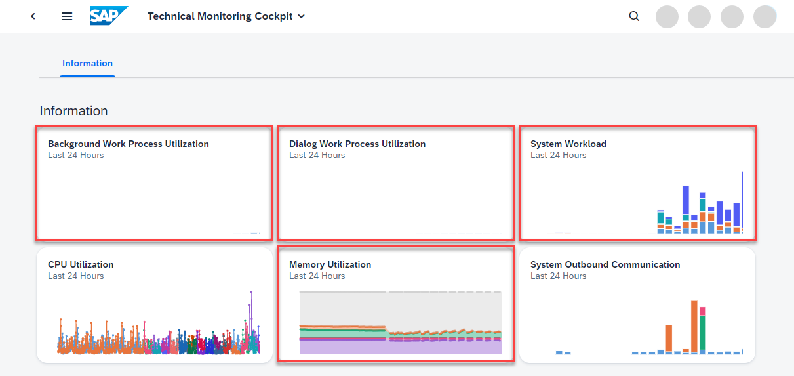
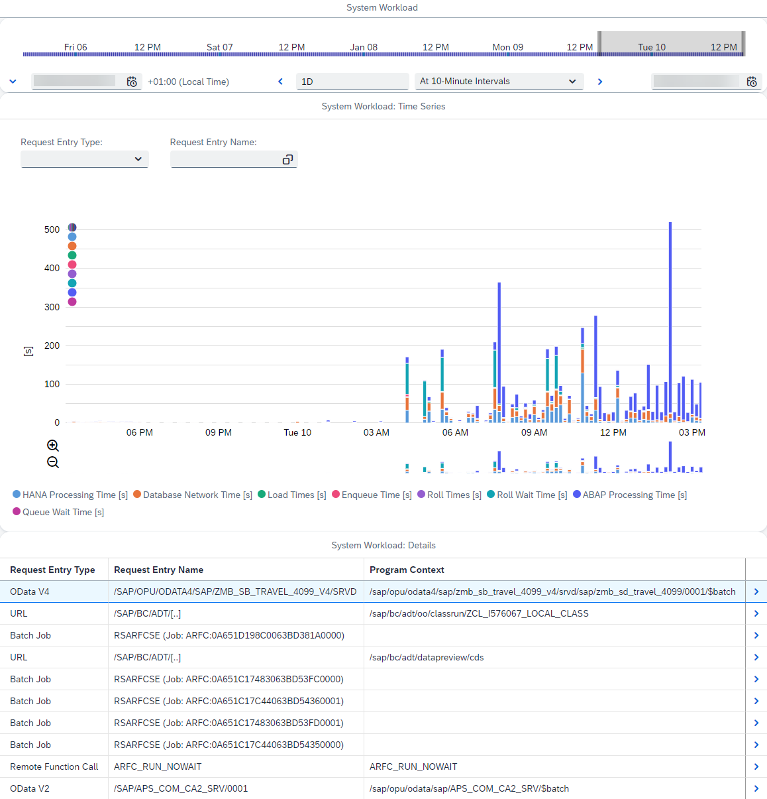

<!-- loioc54ec5e640b44651828300e44b110b1c -->

# Analyzing the ABAP Resource Utilization of the ABAP Environment

<a name="loioc54ec5e640b44651828300e44b110b1c__context_e3p_pg5_3pb"/>

## Context

When you're planning, for example, system capacities or facing performance issues with SAP or partner cloud services running on the ABAP enviroment, you want to understand the resource utilization of your ABAP environment.

<a name="loioc54ec5e640b44651828300e44b110b1c__steps_f3p_pg5_3pb"/>

## Procedure

1.  On the SAP Fiori launchpad of your ABAP environment, search for *Application System Overview*.

    The technical monitoring cockpit opens.

2.  To gain insights into the memory utilization of the ABAP application server, choose the *Memory Utilization* tile.

    

    For more information about the *Memory Utilization* screen, see [Memory Utilization \(Application Server ABAP\)](https://help.sap.com/viewer/tmc_cloud/d4d31df7fa044d6ebe0a47ee449cbacb.html).

3.  To gain further insights into the work process utilization of the ABAP application server, choose the *Batch Work Process Utilization* and the *Dialog Work Process Utilization* tiles.

    A high load on the batch work processes isn’t critical if it’s only for a short duration. If the batch work process utilization is at 100%, jobs are started delayed.

    For more information about the *Work Process Utilization* screen, see [Work Process Utilization](https://help.sap.com/viewer/tmc_cloud/14104d33a68d44e3848780368b76db8a.html).

4.  To gain more insights into the application workload of the system, choose the *System Workload* tile from the application system dashboard.

    Click on any peak in the chart to get the top 10 most contributing ABAP requests in the *System Workload: Details* section.

    

    For more information about the *System Workload* screen, see [System Workload](https://help.sap.com/viewer/tmc_cloud/178c9777ad174bf5a2710312f009745a.html).

