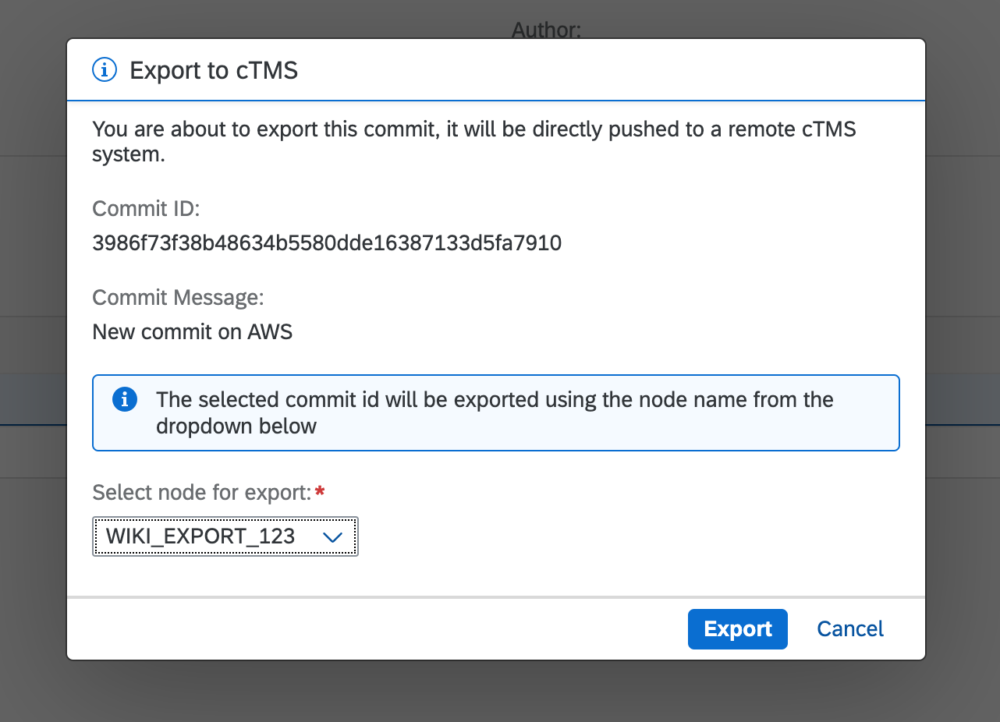

<!-- loiob837a3b4226843cb86e8c35d2f35e6fa -->

# How to Export Using SAP Cloud Transport Management

<a name="loiob837a3b4226843cb86e8c35d2f35e6fa__section_ify_m3j_bwb"/>

## Context

1.  A developer creates and modifies ABAP coding in the SAP BTP, ABAP environment by using the Eclipse-based IDE \(ABAP Development Tools\) with a rich debugger, troubleshooting, and testing tool support.
2.  The changes are recorded in an ABAP transport request that is finally released. During the release, the changes are committed and pushed to the configured development branch of the corresponding Git repository \(there is a one-to-one relation between an ABAP software component and a Git repository\).
3.  After testing and after the release decision, a release branch is created from the main branch.
4.  The resulting combination of the corresponding software component and either the commit ID, Git tag, or the branch name is used as a reference by the following export call to the cloud transport management service \(cTMS\). It is recommended using the commit ID, because the latest commit of a branch may change, resulting in unreproducible deployments.
5.  In cTMS a transport request is created containing the reference and added to the import queue of the following cTMS node \(given by the configured service transport route\).
6.  Finally, a transport administrator uses the cloud transport management service UI to generate the import to the SAP BTP, ABAP system configured on the cTMS transport route. In doing so, the service calls an import API of the target SAP BTP, ABAP environment system by passing the reference.
7.  The import is done asynchronously, and the progress status is monitored by the service. When the import is finished, the service receives the transport logs from the target SAP BTP, ABAP environment instance.

<a name="loiob837a3b4226843cb86e8c35d2f35e6fa__section_bbr_43j_bwb"/>

## Procedure

Before we can start releasing transport requests that generate commits, a new communication arrangement is needed in order to use an endpoint.

1.  Create a service instance and a service key of SAP Cloud Transport Management service. For more information, see [Creating a Service Instance and a Service Key](https://help.sap.com/docs/TRANSPORT_MANAGEMENT_SERVICE/7f7160ec0d8546c6b3eab72fb5ad6fd8/f44956035ce54684b1dbb9e4d23c37d2.html).
2.  Navigate to the [Communication Arrangements](https://help.sap.com/docs/BTP/65de2977205c403bbc107264b8eccf4b/1decd8b8747443ee8839ce4474a3643e.html) Fiori app.

3.  Click on *New* and search for `SAP_COM_0599` communication scenario in the list. Type in the name. Click on *Create*.

4.  On the following screen, a new communication system should be created. Click on *New*. Type in your System ID, which is the URI from your service key. Click on *Create*.

5.  On the communication system creation page find general properties and define the *Host Name* parameter according to the URI property in the service key created for SAP Cloud Transport Management service. For example *https://transport-service-app-backend.ts.cfapps.eu10.hana.ondemand.com*

6.  Then find *OAuth 2.0 Settings* and put in a *Token Endpoint*, which is the URL from your service key. For example tmststest.authentication.sap.hana.ondemand.com/oauth/token?grant\_type=client\_credentials

    .

7.  Now it's time to create a user for outbound communication. Click on *\+* and select oAuth 2.0 from the authentication method dropdown.

8.  Type in your OAuth 2.0 client ID and client secret that can be taken from the service key for the basic authentication. Click on *Create*.

9.  Define a cTMS node name that you will need for the export. The selected transport node must allow uploads and you should use the same name when creating the communication arrangement and creating the same in cTMS.

    For more information, see [Create Transport Nodes](https://help.sap.com/docs/TRANSPORT_MANAGEMENT_SERVICE/7f7160ec0d8546c6b3eab72fb5ad6fd8/f71a4d5550cd453ea824d5b5c677969d.html?version=Cloud). Click *Save* afterwards to complete the process.

### Export to SAP Cloud Transport Management using the Manage Software Components app

1.  Open the *Manage Software Components* app and navigate to the desired software component and a branch.
2.  Select a commit for the export and click on the *Export to cTMS* button.

      

3.  A new dialog will open, where you will be prompted to select a cTMS node you want to use for this export.

      

4.  Click on *Export* after you are ready with the selection. A status modal in the center of the screen will let you know if the process was completed successfully.

5.  In case of an error, you will get an HTTP error code with a description.

**Related Information**  

[Set Up the Environment to Transport Content Archives directly in an Application](https://help.sap.com/docs/TRANSPORT_MANAGEMENT_SERVICE/7f7160ec0d8546c6b3eab72fb5ad6fd8/8d9490792ed14f1bbf8a6ac08a6bca64.html?version=Cloud)

[Configuring the Landscape](https://help.sap.com/docs/TRANSPORT_MANAGEMENT_SERVICE/7f7160ec0d8546c6b3eab72fb5ad6fd8/3e7b04236d804a4eb80e42c6360209f1.html?version=Cloud)

[Using the Import Queue](https://help.sap.com/docs/TRANSPORT_MANAGEMENT_SERVICE/7f7160ec0d8546c6b3eab72fb5ad6fd8/3c4b6f38866b4a70b20e79501db5f7e5.html?version=Cloud&q=loio3c4b6f38866b4a70b20e79501db5f7e5)

[Creating Destinations for Deployment of References of SAP BTP, ABAP environment](https://help.sap.com/docs/TRANSPORT_MANAGEMENT_SERVICE/7f7160ec0d8546c6b3eab72fb5ad6fd8/30144538f2c247be9e1a076754e06bb8.html?version=Cloud)

