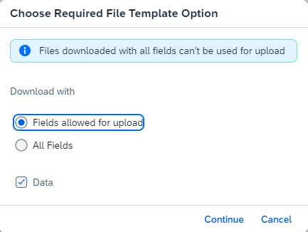

<!-- loio92fd1bee000543018041f58be2819cf6 -->

# How to Upload Business Configurations

You want to import your configuration content via ".xlsx" file upload.

1.  Open the *Upload Business Configuration* app.
2.  In the *Selecht Object* step, open the value help to select the *Object Name* from the allowed list of objects.
3.  Select one of the following operations from the drop-down menu:

    -   *Upsert \(Update or/and Insert\)*: Updates existing entries and inserts new entries.
    -   *Insert \(Insert Only\)*: Inserts new entries but doesn't overwrite/update existing entries.
    -   *Replace \(Replace Existing Records\)*: Replaces any existing entries with the new list of entries. Keep in mind that existing entries will be deleted. This action cannot be undone.

    Click *Step 2* to continue.

4.  Select *Download File Template* to download the file with a templatized example of the object selected. See the *Download File Template* section below for details.

5.  Upload the adjusted downloaded file which contains the configuration content for the selected object. Once you uploaded it, select *Step 3*.

6.  In the *Select Configuration Data* step, the configuration content from the file you uploaded is displayed. You can unselect the rows you don't want upload and click on *Review* to continue.

7.  Review the information. If everything is correct, select *Deploy*.

8.  Based on the system and object settings, you may get a pop-up with a defaulted transport request or no pop-up appears. You can change the transport request by selecting another one from the list. For more informations see *Transport Request* section below.

9.  Select your transport request and confirm it with the OK button. The changes will be sent for deployment to be captured in the provided transport request.

<a name="loio92fd1bee000543018041f58be2819cf6__section_lx2_2z5_vxb"/>

## Transport Request

The transfer request pop-up is based on the system and object settings. If a transport request is mandatory for the selected object and the transport is not hidden, then the transport request which is selected by default is either the *Open Default Customizing/Cross-Client Customizing Request* in the *Export Customizing Transports* app or the task which was last used by the current user. If no pop-up appears, the default request was selected and you'll get a confirmation message.

In case there is no available transport request in the transport dialog, or you want to create a new request, select *Create* in the transport dialog. You'll then be redirected to the *Export Customizing Transports* app in a new tab. Once redirected, you can then create a new request.

After creating a new transport request in the *Export Customizing Transports* app, you can find it in the *Upload Business Configuration* app by using the value help.

<a name="loio92fd1bee000543018041f58be2819cf6__section_hbr_gz5_vxb"/>

## Download File Template

By selecting *Download File Template* a pop-up will appear.

There are two options to download the file

1.  *Fields allowed for upload* downloads the file which can be used for uploading configuration content. You can always adjust the content according to your requirements before uploading it.

2.  *All Fields* provides the additional capability to download the file with all the fields of the selected object, including read-only field

If the*Data* option is selected the file will be downloaded with the current configuration. If this option is deselected a blank file will be downloaded.

