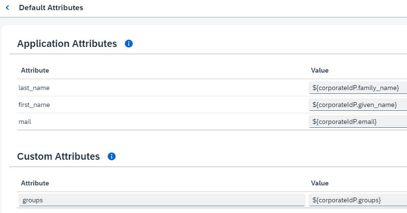

<!-- loio40c2e54a5eb140baa46ed5bb15de4d3b -->

# Map User Attributes from a Corporate Identity Provider for Platform Users

When you enable trust with a tenant of SAP Cloud Identity Services - Identity Authentication, you get an OpenID Connect \(OIDC\) application in Identity Authentication to represent SAP BTP, in the context of platform users. When you authenticate users using a corporate identity provider, map the user attributes provided by the corporate identity provider to the attributes required by SAP BTP. The following information explains which attributes SAP BTP needs for which purpose, and how you can map those attributes.

<a name="loio40c2e54a5eb140baa46ed5bb15de4d3b__section_yv2_3cr_qsb"/>

## Finding the Application for Your Platform Users

The name of the application in the administration console of Identity Authentication that represents SAP BTP in the context of platform users has the name, *SAP Business Technology Platform*.

For more information, see [OpenID Connect](https://help.sap.com/viewer/6d6d63354d1242d185ab4830fc04feb1/Cloud/en-US/a789c9c8c0f5439da8c30b5d9e43bece.html) in the documentation of Identity Authentication.

<a name="loio40c2e54a5eb140baa46ed5bb15de4d3b__section_wdh_bwq_qsb"/>

## Customizing Attribute Mappings

There are several options to customize attribute mappings in Identity Authentication, depending on whether identity federation is enabled or disabled. For more information about identity federation, see [Configure Identity Federation](https://help.sap.com/docs/IDENTITY_AUTHENTICATION/6d6d63354d1242d185ab4830fc04feb1/c029bbbaefbf4350af15115396ba14e2.html?version=Cloud).

-   When identity federation is disabled, Identity Authentication always propagates all the attributes received from the corporate identity provider to all the applications, on a 1:1 basis.
    -   Configure the corporate identity provider to directly send the attributes.

    -   If needed, use **enriched token claims** or **enriched assertion attributes** \(if the corporate identity provider is connected with SAML\) to map the attributes sent by the corporate identity provider, to the attribute names needed by BTP.

        **[Enriched token claims](https://help.sap.com/docs/IDENTITY_AUTHENTICATION/6d6d63354d1242d185ab4830fc04feb1/f19e580088e74aaa96087f1def8972cd.html?version=Cloud)** or **[enriched assertion attributes](https://help.sap.com/docs/IDENTITY_AUTHENTICATION/6d6d63354d1242d185ab4830fc04feb1/7124201682434efb946e1046fde06afe.html?version=Cloud&q=Enriched%20assertion%20attributes)** add additional attributes, either based on the corporate identity provider attributes \(for example, by renaming them\) or on static values.

-   When identity federation is enabled, Identity Authentication doesn't automatically propagate any attributes from the corporate identity provider to the application. This option requires mappings in the Identity Authentication application, for each attribute that is needed by the application.

    Use the *default attributes* in the Identity Authentication application representing SAP BTP.

    > ### Note:  
    > You cannot add or remove attributes or edit the listed attribute names, but you can edit their values, depending on which attribute from the corporate identity provider maps to these attributes.

      

    If the corporate identity provider sends user attributes for email address, first and last name with other names than *email*, *given\_name*, or *family\_name*, set the right attribute name by replacing those values.

    > ### Example:  
    > If your corporate identity provider sends users' last names as attribute `sn`, map the `sn` attribute to the `last_name` attribute required by SAP BTP with the value ***$\{corporateIdP.sn\}***.

    For more information, see [Configure the Default Attributes Sent to the Application](https://help.sap.com/docs/IDENTITY_AUTHENTICATION/6d6d63354d1242d185ab4830fc04feb1/a2f1e4692e7d4379ab82144ab309e7b3.html?version=Cloud&q=corporateidp).

The following table provides the information needed for mapping the attributes, independently from where you do this in Identity Authentication.

The subject name identifier attribute is used by SAP BTP to uniquely identify the user in Neo subaccounts. The e-mail address is used as the user identifier in the the Cloud Foundry environment \(global account, directory, multi-environment subaccount\).

For more information, see [Configure the Subject Name Identifier Sent to the Application](https://help.sap.com/viewer/6d6d63354d1242d185ab4830fc04feb1/Cloud/en-US/1d020e3a3ba34c43a71fde70bfa6419a.html) in the documentation of Identity Authentication.

**Attribute Mapping in Identity Authentication Tokens**

<table>
<tr>
<th valign="top">

User Attribute Expected by SAP BTP

</th>
<th valign="top">

Purpose

</th>
</tr>
<tr>
<td valign="top">

 `Subject name identifier` 

</td>
<td valign="top">

This is the user identifier for Neo subaccounts.

Default value: ***User ID***

</td>
</tr>
<tr>
<td valign="top">

 `mail` 

</td>
<td valign="top">

E-mail address of the user.

> ### Note:  
> This is the user identifier for all the account levels \(global account, directory, multi-environment subaccount\), and for the Cloud Foundry environment.

The e-mail addresses of all the users in the Identity Authentication tenant must be unique.

For more information, see the [prerequisites](establish-trust-and-federation-of-custom-identity-providers-for-platform-users-feature-c368984.md#loioc36898473d704e07a33268c9f9d29515__prereq_avv_mp1_5tb) for establishing trust and federation of custom identity providers for platform users \[feature set B\].

</td>
</tr>
<tr>
<td valign="top">

 `first_name` 

</td>
<td valign="top">

First name of the user.

</td>
</tr>
<tr>
<td valign="top">

 `last_name` 

</td>
<td valign="top">

Last name of the user.

</td>
</tr>
</table>

**Related Information**  

[Establish Trust and Federation Between UAA and Identity Authentication](establish-trust-and-federation-between-uaa-and-identity-authentication-161f8f0.md "Use your SAP Cloud Identity Services - Identity Authentication tenant as an identity provider or a proxy to your own identity provider hosting your business users. This method avoids the upload and download of SAML meta data by using Open ID Connect (OIDC) to establish trust.")

[Establish Trust and Federation of Custom Identity Providers for Platform Users in Multi-Environment Subaccounts \[Feature Set A\]](establish-trust-and-federation-of-custom-identity-providers-for-platform-users-in-multi-8600afb.md "By default, platform users in multi-environment subaccounts are users in SAP ID service. The use of your own identity provider requires integration between the user bases of multi-environment and Neo subaccounts.")

[Map User Attributes from a Corporate Identity Provider for Business Users](map-user-attributes-from-a-corporate-identity-provider-for-business-users-bbb4a8a.md "When you enable trust with a tenant of SAP Cloud Identity Services - Identity Authentication, you get an OpenID Connect (OIDC) application in Identity Authentication to represent your subaccount, in the context of business users. When Identity Authentication authenticates users using a corporate identity provider, map the user attributes provided by the corporate identity provider to the attributes required by your applications.")

