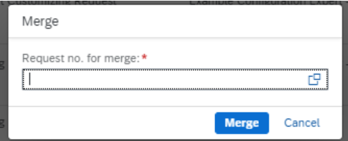

<!-- loiocc16fd0c10ef4ed39a50ac718c71e5a8 -->

# Working in the Export Customizing Transports App

Find out how to create, release, or merge customizing requests using the *Export Customizing Transports* app.

-   If a software component of the type `Business Configuration` is available in the system, the created request will target this software component. If no such software component is available, the request will be created without any target.
-   The target of a request can currently only be changed in the ADT editor.

<a name="loiocc16fd0c10ef4ed39a50ac718c71e5a8__section_qfh_hwf_bpb"/>

## Create Request

1.  Open the *Export Customizing Transports* app. A list of customizing requests is displayed, with the latest request shown first at the top.
2.  Use the search bar to filter for specific requests based on search criteria like the *Request No*, the *Owner*, or the *Status*.
3.  Click *Create* to create a new request.

    > ### Note:  
    > There can only be one open request of type *Customizing* with category *Default*.

4.  Add business configurations to this request by, for instance, using the [Upload Business Configuration](upload-business-configuration-c8ca7be.md) app or the [Manage Number Range Intervals](manage-number-range-intervals-2edf0f2.md) app.

<a name="loiocc16fd0c10ef4ed39a50ac718c71e5a8__section_kcp_j5s_vrb"/>

## Display Request

1.  Navigate to a request's object page to display its tasks, objects, attributes, and logs.
2.  Select a customizing task to display the objects recorded in it.
3.  Select an object to display the table keys recorded in it.

<a name="loiocc16fd0c10ef4ed39a50ac718c71e5a8__section_wmc_m5s_vrb"/>

## Release Request

1.  Release any tasks belonging to your transport request. A request can't be released until all its tasks have been released.
2.  Check the consistency of your request by triggering a release simulation: Select the request and click *Release* \> *Simulate*.
3.  You can also release your request directly without triggering a simulation: Select the request and click *Release* \> *Execute*.

4.  To refresh the status of a released or simulated request: Select the request with the status *Checking* or *Release Started* and click *Refresh*.

      

5.  View the results of the simulation or direct release in the *Logs* tab.

<a name="loiocc16fd0c10ef4ed39a50ac718c71e5a8__section_n3q_tnx_stb"/>

## Delete Request

You can only delete requests which have the status *Modifiable* and have not been released yet.

1.  Select the request you want to delete.

2.  Select *Delete*

3.  To confirm the deletion, click on *Delete* again. Once confirmed, the request and all containing tasks are deleted and disapper from the list

<a name="loiocc16fd0c10ef4ed39a50ac718c71e5a8__section_mh5_ljs_vrb"/>

## Merge Request

If there are dependencies between different requests or several business users have recorded their configuration changes in different requests, you can choose to merge these different requests into one.

1.  Select the request you want to merge.

2.  Select *Merge*.

3.  In the selection dialog, enter the target request number to which the selected request should be merged, and click *Merge*.

      

> ### Note:  
> The configuration changes recorded in the request you selected to merge are copied to the target request. After merging, the previously selected request will be deleted.

<a name="loiocc16fd0c10ef4ed39a50ac718c71e5a8__section_ljq_mjs_vrb"/>

## Create Copy

The exported request, which contains the business configurations, is not synchronized to the Git repository. To synchronize these business configuration with the Git repository again, you can create a copy of a request.

1.  Select the request you want to copy.

2.  Click on *Create Copy*.

> ### Note:  
> You can always delete objects recorded in a tasks, which are not required to be exported again.

<a name="loiocc16fd0c10ef4ed39a50ac718c71e5a8__section_kk2_ck3_ptb"/>

## Assign To Me

It's possible to take over the ownership of a request by using the *Assign To Me* button.

1.  Select a request you want to assign to yourself.

2.  Click on *Assign To Me*

> ### Note:  
> The request is now assigned to you. With this option only you can manage the corresponding request.

